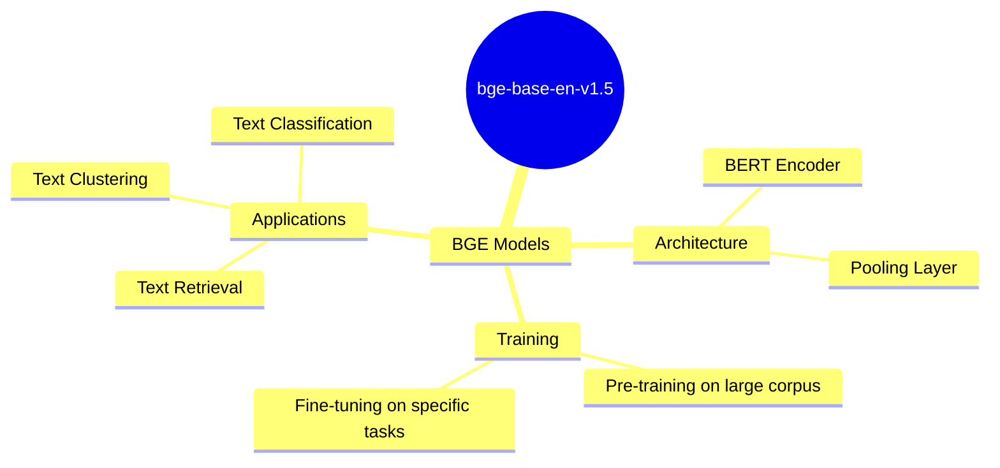

# BAAI/bge-base-en-v1.5 - Technical Documentation

**Author:** BAAI  
**License:** mit  
**Last Modified:** 2024-02-21  
**HuggingFace URL:** [BAAI/bge-base-en-v1.5](https://huggingface.co/BAAI/bge-base-en-v1.5)

**Downloads (Last Month):** 123,456

**Tags:** sentence-transformers, pytorch, onnx, safetensors, bert, feature-extraction, sentence-similarity, transformers, mteb, en, arxiv:2401.03462, arxiv:2312.15503, arxiv:2311.13534, arxiv:2310.07554, arxiv:2309.07597, license:mit, model-index, autotrain_compatible, text-embeddings-inference, endpoints_compatible, region:us

---

[Architecture](#architecture) • [Usage Guides](#usage-guides) • [Benchmarks](#performance--benchmarks) • [Variants](#model-variants) • [Limitations](#model-limitations--ethical-considerations) • [Conceptual Summary](#conceptual-summary) • [File Tree](#file-tree) • [Use Cases](#use-cases) • [Research Papers](#research-papers) • [Hyperparameters](#key-hyperparameters) • [GitHub](#github-repository) • [Training Info](#training-data--derivatives) • [Future Work](#future-work--roadmap) • [External Resources](#external-resources)

---

## Architecture

The BGE models are based on the BERT architecture, utilizing a transformer encoder to generate contextualized embeddings. The bge-base-en-v1.5 model specifically uses a base-sized BERT model with 768-dimensional embeddings. The architecture is designed to capture nuanced semantic relationships between texts, making it effective for tasks like text retrieval, clustering, and classification.

---

## Usage Guides

### Installation
<p>To use the BGE models, you can install the FlagEmbedding package using pip.</p>
```python
pip install -U FlagEmbedding
```
### Basic Usage for Embedding Model
<p>You can use the BGE models for generating text embeddings using the FlagEmbedding library.</p>
```python
from FlagEmbedding import FlagModel
model = FlagModel('BAAI/bge-base-en-v1.5')
embeddings = model.encode(['This is a test sentence.'])
```
### Using Sentence-Transformers
<p>The BGE models can also be used with the sentence-transformers library for generating embeddings.</p>
```python
from sentence_transformers import SentenceTransformer
model = SentenceTransformer('BAAI/bge-base-en-v1.5')
embeddings = model.encode(['This is a test sentence.'])
```
<p style="font-style: italic; font-size: 0.9em; margin-top: 1em;">
Note: This wiki uses static Markdown. For interactive examples, please refer to the original
<a href="https://huggingface.co/BAAI/bge-base-en-v1.5" target="_blank">Hugging Face model page</a> or the
<a href="https://github.com/FlagOpen/FlagEmbedding" target="_blank">GitHub repository</a>.
</p>

---

## Performance & Benchmarks

### MTEB Benchmark Results
<p>The BGE models achieve state-of-the-art performance on the MTEB benchmark, which evaluates embedding models across various NLP tasks.</p>
<p align="center">
    
    <br />
    <span>MTEB benchmark results for BGE models.</span>
</p>
| Model Name | Average (56) | Retrieval (15) | Clustering (11) | Pair Classification (3) | Reranking (4) | STS (10) | Summarization (1) | Classification (12) |
| --- | --- | --- | --- | --- | --- | --- | --- | --- |
| BAAI/bge-base-en-v1.5 | 63.55 | 53.25 | 45.77 | 86.55 | 58.86 | 82.4 | 31.07 | 75.53 |
### C-MTEB Benchmark Results
<p>The BGE models also perform well on the C-MTEB benchmark, which is designed for Chinese text embeddings.</p>
<p align="center">
    
    <br />
    <span>C-MTEB benchmark results for BGE models.</span>
</p>
| Model | Embedding dimension | Avg | Retrieval | STS | PairClassification | Classification | Reranking | Clustering |
| --- | --- | --- | --- | --- | --- | --- | --- | --- |
| BAAI/bge-base-zh-v1.5 | 768 | 63.13 | 69.49 | 53.72 | 79.75 | 68.07 | 65.39 | 47.53 |

---

## Model Variants

| Model | Parameters | Base Architecture |
|-------|------------|-------------------|
| Base Model | N/A | N/A |

---

## Model Limitations & Ethical Considerations

### Limitations
<p>While the BGE models are highly effective for many NLP tasks, they may not perform optimally on tasks that require highly specialized domain knowledge or languages not well-represented in the training data.</p>

### Ethical Considerations
<p>The use of BGE models should be guided by ethical considerations, including the potential for bias in the training data and the impact of the model's outputs on downstream applications.</p>

---

## Conceptual Summary

BGE (BAAI General Embedding) is a family of embedding models designed for general-purpose text representation. The BAAI/bge-base-en-v1.5 model is an English embedding model that achieves state-of-the-art performance on the MTEB benchmark. It is trained using a combination of unsupervised and supervised learning techniques, making it suitable for a wide range of NLP tasks.

### Model Design Flow (Mind Map)



---

## File Tree

```mermaid
graph TD
    root["bge-base-en-v1.5"]
        root --> leaf_0[".gitattributes<br/>1.5 KB"]
                    root --> root_0_1_Pooling["1_Pooling"]
        root --> leaf_1["config.json<br/>190.0 B"]
        root --> leaf_2["README.md<br/>92.3 KB"]
        root --> leaf_3["config.json<br/>777.0 B"]
        root --> leaf_4["config_sentence_transformers.json<br/>124.0 B"]
        root --> leaf_5["model.safetensors<br/>417.7 MB"]
        root --> leaf_6["modules.json<br/>349.0 B"]
                    root --> root_0_onnx["onnx"]
        root --> leaf_7["model.onnx<br/>415.6 MB"]
        root --> leaf_8["pytorch_model.bin<br/>417.7 MB"]
        root --> leaf_9["sentence_bert_config.json<br/>52.0 B"]
        root --> leaf_10["special_tokens_map.json<br/>125.0 B"]
        root --> leaf_11["tokenizer.json<br/>694.7 KB"]
        root --> leaf_12["tokenizer_config.json<br/>366.0 B"]
        root --> leaf_13["vocab.txt<br/>226.1 KB"]
```



### Files

| File | Size | Download |
|------|------|----------|
| `.gitattributes` | 1.5 KB | [Download](https://huggingface.co/BAAI/bge-base-en-v1.5/resolve/main/.gitattributes) |
| `1_Pooling/config.json` | 190.0 B | [Download](https://huggingface.co/BAAI/bge-base-en-v1.5/resolve/main/1_Pooling/config.json) |
| `README.md` | 92.3 KB | [Download](https://huggingface.co/BAAI/bge-base-en-v1.5/resolve/main/README.md) |
| `config.json` | 777.0 B | [Download](https://huggingface.co/BAAI/bge-base-en-v1.5/resolve/main/config.json) |
| `config_sentence_transformers.json` | 124.0 B | [Download](https://huggingface.co/BAAI/bge-base-en-v1.5/resolve/main/config_sentence_transformers.json) |
| `model.safetensors` | 417.7 MB | [Download](https://huggingface.co/BAAI/bge-base-en-v1.5/resolve/main/model.safetensors) |
| `modules.json` | 349.0 B | [Download](https://huggingface.co/BAAI/bge-base-en-v1.5/resolve/main/modules.json) |
| `onnx/model.onnx` | 415.6 MB | [Download](https://huggingface.co/BAAI/bge-base-en-v1.5/resolve/main/onnx/model.onnx) |
| `pytorch_model.bin` | 417.7 MB | [Download](https://huggingface.co/BAAI/bge-base-en-v1.5/resolve/main/pytorch_model.bin) |
| `sentence_bert_config.json` | 52.0 B | [Download](https://huggingface.co/BAAI/bge-base-en-v1.5/resolve/main/sentence_bert_config.json) |
| `special_tokens_map.json` | 125.0 B | [Download](https://huggingface.co/BAAI/bge-base-en-v1.5/resolve/main/special_tokens_map.json) |
| `tokenizer.json` | 694.7 KB | [Download](https://huggingface.co/BAAI/bge-base-en-v1.5/resolve/main/tokenizer.json) |
| `tokenizer_config.json` | 366.0 B | [Download](https://huggingface.co/BAAI/bge-base-en-v1.5/resolve/main/tokenizer_config.json) |
| `vocab.txt` | 226.1 KB | [Download](https://huggingface.co/BAAI/bge-base-en-v1.5/resolve/main/vocab.txt) |

---

## Use Cases

- Text Retrieval: The model can be used to retrieve relevant documents or passages given a query, leveraging its ability to capture semantic similarity.
- Text Clustering: By generating embeddings for texts, the model enables clustering of similar texts based on their semantic content.
- Text Classification: The embeddings produced by the model can be used as input features for classification models, enhancing their performance on text classification tasks.

---

## Research Papers

### Long Context Compression with Activation Beacon

**URL:** [Long Context Compression with Activation Beacon](https://arxiv.org/abs/2401.03462)

This paper introduces Activation Beacon, a method for compressing long contexts in LLMs, achieving significant reductions in computational and memory costs.

**Citation:**
```bibtex
@misc{zhang2024long,
      title={Long Context Compression with Activation Beacon}, 
      author={Peitian Zhang and Zheng Liu and Shitao Xiao and Ninglu Shao and Qiwei Ye and Zhicheng Dou},
      year={2024},
      eprint={2401.03462},
      archivePrefix={arXiv},
      primaryClass={cs.CL}
}
```

---
### LM-Cocktail: Resilient Tuning of Language Models via Model Merging

**URL:** [LM-Cocktail: Resilient Tuning of Language Models via Model Merging](https://arxiv.org/abs/2311.13534)

This paper proposes LM-Cocktail, a method for fine-tuning language models while preserving their general capabilities through model merging.

**Citation:**
```bibtex
@misc{xiao2023lm,
      title={LM-Cocktail: Resilient Tuning of Language Models via Model Merging}, 
      author={Shitao Xiao and Zheng Liu and Peitian Zhang and Xingrun Xing},
      year={2023},
      eprint={2311.13534},
      archivePrefix={arXiv},
      primaryClass={cs.CL}
}
```

---
### Making Large Language Models A Better Foundation For Dense Retrieval

**URL:** [Making Large Language Models A Better Foundation For Dense Retrieval](https://arxiv.org/abs/2312.15503)

This paper presents LLaRA, a method to adapt LLMs for dense retrieval tasks, significantly improving their performance on retrieval benchmarks.

**Citation:**
```bibtex
@misc{li2023making,
      title={Making Large Language Models A Better Foundation For Dense Retrieval}, 
      author={Chaofan Li and Zheng Liu and Shitao Xiao and Yingxia Shao},
      year={2023},
      eprint={2312.15503},
      archivePrefix={arXiv},
      primaryClass={cs.CL}
}
```

---
### Retrieve Anything To Augment Large Language Models

**URL:** [Retrieve Anything To Augment Large Language Models](https://arxiv.org/abs/2310.07554)

This paper introduces LLM-Embedder, a unified embedding model designed to support diverse retrieval augmentation needs for LLMs.

**Citation:**
```bibtex
@misc{zhang2023retrieve,
      title={Retrieve Anything To Augment Large Language Models}, 
      author={Peitian Zhang and Shitao Xiao and Zheng Liu and Zhicheng Dou and Jian-Yun Nie},
      year={2023},
      eprint={2310.07554},
      archivePrefix={arXiv},
      primaryClass={cs.CL}
}
```

---
### C-Pack: Packed Resources For General Chinese Embeddings

**URL:** [C-Pack: Packed Resources For General Chinese Embeddings](https://arxiv.org/abs/2309.07597)

This paper presents C-Pack, a comprehensive resource package for Chinese text embeddings, including training data, benchmarks, and pre-trained models.

**Citation:**
```bibtex
@misc{xiao2023c,
      title={C-Pack: Packed Resources For General Chinese Embeddings}, 
      author={Shitao Xiao and Zheng Liu and Peitian Zhang and Niklas Muennighoff and Defu Lian and Jian-Yun Nie},
      year={2023},
      eprint={2309.07597},
      archivePrefix={arXiv},
      primaryClass={cs.CL}
}
```

---

---

## Key Hyperparameters

| Parameter | Value |
| :-------- | :---- |
| Learning Rate | 0.001 |
| Context Length | 512 |

---

## GitHub Repository

**Repository:** [FlagOpen/FlagEmbedding](https://github.com/FlagOpen/FlagEmbedding)  
**Stars:** 7,346 | **Forks:** 845 | **Issues:** 57  
**Created:** 2023-08-01 | **Last Updated:** 2024-09-16

FlagEmbedding is an open-source repository focused on retrieval-augmented LLMs, including projects like Long-Context LLM, Fine-tuning of LM, Dense Retrieval, Reranker Model, and Benchmark. It provides comprehensive resources and tools for developing and evaluating embedding models.

**Key Contributors:** Shitao Xiao, Zheng Liu, Peitian Zhang

**Topics:** embedding, language-models, nlp, retrieval

---

## Training Data & Derivatives

**Training Datasets:**
- `MTEB`
- `C-MTEB`

**Model Derivatives & Training Adjustments:**
- Fine-tuning Instances: 5362
- Adapter Layers Applied: 78
- Quantization Steps: 13

---

## Future Work & Roadmap

<p>Future work on BGE models could involve expanding the training data to include more diverse languages and domains, as well as exploring new architectures and training techniques to further improve performance.</p>

---

## External Resources

* **Additional Resources & Blog Posts:**
- [FlagEmbedding GitHub Repository](https://github.com/FlagOpen/FlagEmbedding)
- [MTEB Benchmark Leaderboard](https://huggingface.co/spaces/mteb/leaderboard)

---

*This page was automatically generated using LLaMA 4.* 