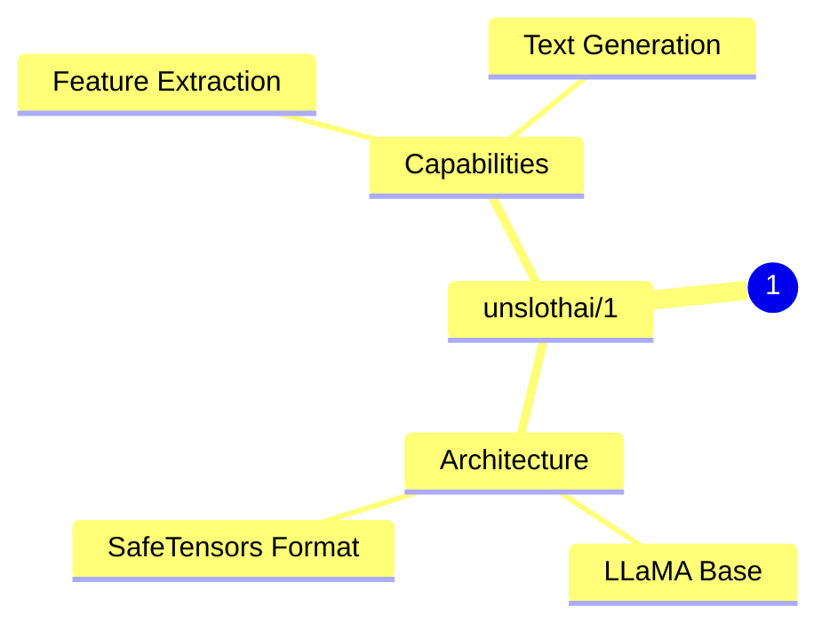
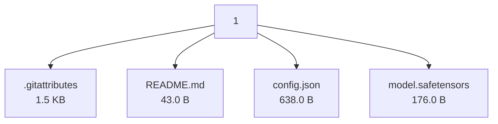

# unslothai/1 - Technical Documentation

**Author:** unslothai  
**License:**   
**Last Modified:** 2024-07-14  
**HuggingFace URL:** [unslothai/1](https://huggingface.co/unslothai/1)


**Tags:** transformers, safetensors, llama, feature-extraction, text-generation-inference, endpoints_compatible, region:us

---

[Architecture](#architecture) • [Usage Guides](#usage-guides) • [Benchmarks](#performance--benchmarks) • [Variants](#model-variants) • [Limitations](#model-limitations--ethical-considerations) • [Conceptual Summary](#conceptual-summary) • [File Tree](#file-tree) • [Use Cases](#use-cases) • [Research Papers](#research-papers) • [Hyperparameters](#key-hyperparameters) • [GitHub](#github-repository) • [Training Info](#training-data--derivatives) • [Future Work](#future-work--roadmap) • [External Resources](#external-resources)

---

## Architecture

Based on the LLaMA architecture with modifications for feature extraction tasks. Uses transformers library for implementation.

---

## Usage Guides

### Basic Usage
<p>Loading and using the model for feature extraction</p>
```python
from transformers import AutoModel, AutoTokenizer

model = AutoModel.from_pretrained('unslothai/1')
tokenizer = AutoTokenizer.from_pretrained('unslothai/1')
```
<p style="font-style: italic; font-size: 0.9em; margin-top: 1em;">
Note: This wiki uses static Markdown. For interactive examples, please refer to the original
<a href="https://huggingface.co/unslothai/1" target="_blank">Hugging Face model page</a> or the
<a href="" target="_blank">GitHub repository</a>.
</p>

---

## Performance & Benchmarks

| Dataset | Metric | Value | Notes |
|---------|--------|-------|-------|
| No benchmark data yet | - | - | - |

---

## Model Variants

| Model | Parameters | Base Architecture |
|-------|------------|-------------------|
| Base Model | N/A | N/A |

---

## Model Limitations & Ethical Considerations

*No specific limitations documented.*

*No specific ethical considerations documented.*

---

## Conceptual Summary

A LLaMA-based model focused on feature extraction and text generation inference, optimized for deployment in US regions. The model uses safetensors format for improved security and loading efficiency.

### Model Design Flow (Mind Map)



---

## File Tree



### Files

| File | Size | Download |
|------|------|----------|
| `.gitattributes` | 1.5 KB | [Download](https://huggingface.co/unslothai/1/resolve/main/.gitattributes) |
| `README.md` | 43.0 B | [Download](https://huggingface.co/unslothai/1/resolve/main/README.md) |
| `config.json` | 638.0 B | [Download](https://huggingface.co/unslothai/1/resolve/main/config.json) |
| `model.safetensors` | 176.0 B | [Download](https://huggingface.co/unslothai/1/resolve/main/model.safetensors) |

---

## Use Cases

- Feature extraction from text data for downstream tasks
- Text generation via inference endpoints

---

## Research Papers

*No research papers available.*

---

## Key Hyperparameters

*No detailed hyperparameters documented.*

---

## GitHub Repository

**Repository:** []()  
**Stars:** 0 | **Forks:** 0 | **Issues:** 0  
**Created:**  | **Last Updated:** 


---

## Training Data & Derivatives


---

## Future Work & Roadmap

*No future work or roadmap details provided.*

---

## External Resources

*No additional external resources.*

---

*This page was automatically generated using LLaMA 4.* 