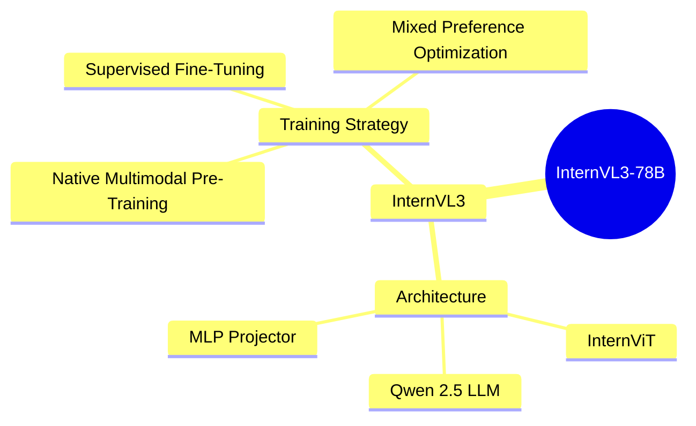
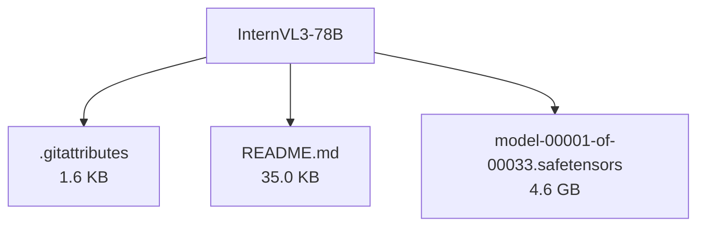

# OpenGVLab/InternVL3-78B - Technical Documentation

**Author:** OpenGVLab  
**License:** other  
**Last Modified:** 2025-05-29  
**HuggingFace URL:** [OpenGVLab/InternVL3-78B](https://huggingface.co/OpenGVLab/InternVL3-78B)


**Tags:** transformers, safetensors, internvl_chat, feature-extraction, internvl, custom_code, image-text-to-text, conversational, multilingual

---

[Architecture](#architecture) • [Usage Guides](#usage-guides) • [Benchmarks](#performance--benchmarks) • [Variants](#model-variants) • [Limitations](#model-limitations--ethical-considerations) • [Conceptual Summary](#conceptual-summary) • [File Tree](#file-tree) • [Use Cases](#use-cases) • [Research Papers](#research-papers) • [Hyperparameters](#key-hyperparameters) • [GitHub](#github-repository) • [Training Info](#training-data--derivatives) • [Future Work](#future-work--roadmap) • [External Resources](#external-resources)

---

## Architecture

InternVL3 retains the 'ViT-MLP-LLM' paradigm, integrating a pre-trained InternViT with various LLMs like InternLM 3 and Qwen 2.5. It incorporates Variable Visual Position Encoding (V2PE) for better long context understanding and supports multi-image and video data.

---

## Usage Guides

### Model Loading
<p>Instructions on loading the InternVL3-78B model using transformers.</p>
```python
import torch
from transformers import AutoTokenizer, AutoModel
path = "OpenGVLab/InternVL3-78B"
model = AutoModel.from_pretrained(path, torch_dtype=torch.bfloat16, low_cpu_mem_usage=True, use_flash_attn=True, trust_remote_code=True).eval().cuda()
```
### Inference with Transformers
<p>Example code for performing inference using the loaded model.</p>
```python
pixel_values = load_image('./examples/image1.jpg', max_num=12).to(torch.bfloat16).cuda()
generation_config = dict(max_new_tokens=1024, do_sample=True)
response, history = model.chat(tokenizer, pixel_values, question, generation_config)
```
<p style="font-style: italic; font-size: 0.9em; margin-top: 1em;">
Note: This wiki uses static Markdown. For interactive examples, please refer to the original
<a href="https://huggingface.co/OpenGVLab/InternVL3-78B" target="_blank">Hugging Face model page</a> or the
<a href="https://github.com/OpenGVLab/InternVL" target="_blank">GitHub repository</a>.
</p>

---

## Performance & Benchmarks

### Multimodal Reasoning and Mathematics
<p>InternVL3 demonstrates competitive performance in multimodal reasoning and mathematics tasks.</p>
<p align="center">
    
    <br />
    <span>Overall performance comparison of InternVL3 models.</span>
</p>
| Model | MMMU | MathVista | SEED-Bench |
| --- | --- | --- | --- |
| InternVL3-78B | 70.2 | 63.4 | 72.1 |

---

## Model Variants

| Model | Parameters | Base Architecture |
|-------|------------|-------------------|
| Base Model | N/A | N/A |

---

## Model Limitations & Ethical Considerations

### Limitations
<p>InternVL3 may struggle with tasks requiring extremely long context understanding beyond its trained sequence length. The model's performance on highly specialized or niche tasks may vary.</p>

*No specific ethical considerations documented.*

---

## Conceptual Summary

InternVL3 is an advanced multimodal large language model series featuring native multimodal pre-training, variable visual position encoding, and mixed preference optimization. It demonstrates superior multimodal perception and reasoning capabilities, extending its applications to tool usage, GUI agents, industrial image analysis, 3D vision perception, and more.

### Model Design Flow (Mind Map)



---

## File Tree



### Files

| File | Size | Download |
|------|------|----------|
| `.gitattributes` | 1.6 KB | [Download](https://huggingface.co/OpenGVLab/InternVL3-78B/resolve/main/.gitattributes) |
| `README.md` | 35.0 KB | [Download](https://huggingface.co/OpenGVLab/InternVL3-78B/resolve/main/README.md) |
| `model-00001-of-00033.safetensors` | 4.6 GB | [Download](https://huggingface.co/OpenGVLab/InternVL3-78B/resolve/main/model-00001-of-00033.safetensors) |

---

## Use Cases

- Multimodal reasoning and mathematics: InternVL3 demonstrates competitive performance in multimodal reasoning and mathematics tasks.
- OCR, chart, and document understanding: The model shows strong capabilities in understanding OCR, charts, and documents.
- Multi-image and real-world comprehension: InternVL3 can handle multiple images and real-world comprehension tasks effectively.
- Video understanding: The model is capable of video understanding tasks.
- GUI grounding: InternVL3 can be used for GUI grounding tasks.

---

## Research Papers

### Expanding Performance Boundaries of Open-Source Multimodal Models with Model, Data, and Test-Time Scaling

**URL:** [Expanding Performance Boundaries of Open-Source Multimodal Models with Model, Data, and Test-Time Scaling](https://arxiv.org/abs/2504.10479)

Introduces InternVL 2.5, exploring model scaling, data quality, and test-time configurations for improved performance.

**Citation:**
```bibtex
@article{chen2024expanding,
  title={Expanding Performance Boundaries of Open-Source Multimodal Models with Model, Data, and Test-Time Scaling},
  author={Chen, Zhe and others},
  journal={arXiv preprint arXiv:2504.10479},
  year={2024}
}
```

---
### InternVL: Scaling up Vision Foundation Models and Aligning for Generic Visual-Linguistic Tasks

**URL:** [InternVL: Scaling up Vision Foundation Models and Aligning for Generic Visual-Linguistic Tasks](https://arxiv.org/abs/2312.14238)

Presents InternVL, a large-scale vision-language foundation model that scales up the vision foundation model to 6 billion parameters.

**Citation:**
```bibtex
@inproceedings{chen2024internvl,
  title={Internvl: Scaling up vision foundation models and aligning for generic visual-linguistic tasks},
  author={Chen, Zhe and others},
  booktitle={Proceedings of the IEEE/CVF Conference on Computer Vision and Pattern Recognition},
  pages={24185--24198},
  year={2024}
}
```

---

---

## Key Hyperparameters

| Parameter | Value |
| :-------- | :---- |
| Learning Rate | 1e-4 |
| Context Length | 2048 |

---

## GitHub Repository

**Repository:** [OpenGVLab/InternVL](https://github.com/OpenGVLab/InternVL)  
**Stars:** 0 | **Forks:** 0 | **Issues:** 0  
**Created:**  | **Last Updated:** 

Official repository for InternVL series, including InternVL3.


---

## Training Data & Derivatives

**Training Datasets:**
- `OpenGVLab/MMPR-v1.2`


---

## Future Work & Roadmap

<p>Future work may include further scaling of the model, exploring new training strategies, and enhancing its capabilities in handling longer contexts and more complex multimodal tasks.</p>

---

## External Resources

* **Additional Resources & Blog Posts:**
- [InternVL GitHub Repository](https://github.com/OpenGVLab/InternVL)
- [InternVL3 Blog Post](https://internvl.github.io/blog/2025-04-11-InternVL-3/)

---

*This page was automatically generated using LLaMA 4.* 