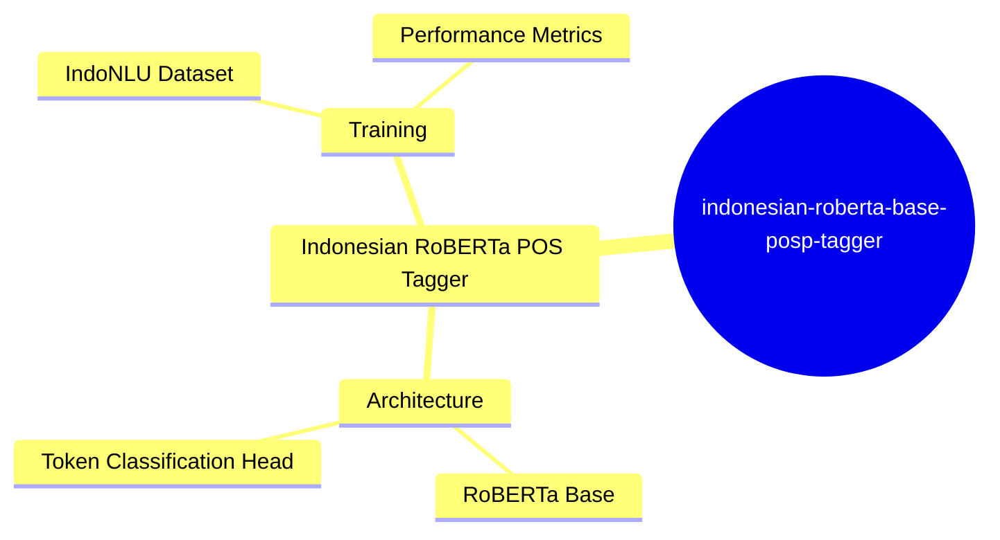
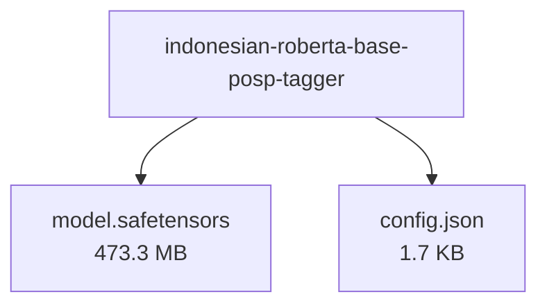

# w11wo/indonesian-roberta-base-posp-tagger - Technical Documentation

**Author:** w11wo  
**License:** mit  
**Last Modified:** 2024-02-19  
**HuggingFace URL:** [w11wo/indonesian-roberta-base-posp-tagger](https://huggingface.co/w11wo/indonesian-roberta-base-posp-tagger)


**Tags:** transformers, token-classification, ind, roberta, indonlu

---

[Architecture](#architecture) • [Usage Guides](#usage-guides) • [Benchmarks](#performance--benchmarks) • [Variants](#model-variants) • [Limitations](#model-limitations--ethical-considerations) • [Conceptual Summary](#conceptual-summary) • [File Tree](#file-tree) • [Use Cases](#use-cases) • [Research Papers](#research-papers) • [Hyperparameters](#key-hyperparameters) • [GitHub](#github-repository) • [Training Info](#training-data--derivatives) • [Future Work](#future-work--roadmap) • [External Resources](#external-resources)

---

## Architecture

The model uses the RoBERTa base architecture fine-tuned for token classification. It builds upon the pre-trained indonesian-roberta-base model, adapting the final layer for POS tagging while maintaining the core transformer architecture with its attention mechanisms and deep bidirectional representations.

---

## Usage Guides

### Basic Usage
<p>Load and use the model for Indonesian POS tagging</p>
```python
from transformers import pipeline

pos_tagger = pipeline('token-classification', model='w11wo/indonesian-roberta-base-posp-tagger')
text = 'Saya sedang belajar bahasa Indonesia.'
result = pos_tagger(text)
```
<p style="font-style: italic; font-size: 0.9em; margin-top: 1em;">
Note: This wiki uses static Markdown. For interactive examples, please refer to the original
<a href="https://huggingface.co/w11wo/indonesian-roberta-base-posp-tagger" target="_blank">Hugging Face model page</a> or the
<a href="" target="_blank">GitHub repository</a>.
</p>

---

## Performance & Benchmarks

### IndoNLU POSP Task Performance
<p>Model evaluation results on the IndoNLU POSP test set showing strong performance across all metrics</p>
| Metric | Score |
|---------|-------|
| Precision | 0.9625 |
| Recall | 0.9625 |
| F1 | 0.9625 |
| Accuracy | 0.9625 |

---

## Model Variants

| Model | Parameters | Base Architecture |
|-------|------------|-------------------|
| Base Model | N/A | N/A |

---

## Model Limitations & Ethical Considerations

### Limitations
<p>The model is specifically trained for Indonesian language and may not perform well on other languages or dialects. Performance may vary on domain-specific text or informal language varieties.</p>

*No specific ethical considerations documented.*

---

## Conceptual Summary

A fine-tuned RoBERTa model for Indonesian part-of-speech tagging, based on the indonesian-roberta-base model. The model achieves strong performance with 96.25% accuracy on the IndoNLU POSP task, demonstrating effective token classification capabilities for Indonesian language processing.

### Model Design Flow (Mind Map)



---

## File Tree



### Files

| File | Size | Download |
|------|------|----------|
| `model.safetensors` | 473.3 MB | [Download](https://huggingface.co/w11wo/indonesian-roberta-base-posp-tagger/resolve/main/model.safetensors) |
| `config.json` | 1.7 KB | [Download](https://huggingface.co/w11wo/indonesian-roberta-base-posp-tagger/resolve/main/config.json) |

---

## Use Cases

- Part-of-speech tagging for Indonesian text, enabling grammatical analysis and linguistic processing
- Natural language processing pipelines requiring token-level grammatical information for Indonesian language

---

## Research Papers

*No research papers available.*

---

## Key Hyperparameters

| Parameter | Value |
| :-------- | :---- |
| Learning Rate | 2e-05 |
| Train Batch Size | 16 |
| Number of Epochs | 10 |
| Optimizer | Adam |

---

## GitHub Repository

**Repository:** []()  
**Stars:** 0 | **Forks:** 0 | **Issues:** 0  
**Created:**  | **Last Updated:** 


---

## Training Data & Derivatives

**Training Datasets:**
- `indonlu`


---

## Future Work & Roadmap

*No future work or roadmap details provided.*

---

## External Resources

* **Additional Resources & Blog Posts:**
- [Base Model: Indonesian RoBERTa](https://huggingface.co/flax-community/indonesian-roberta-base)

---

*This page was automatically generated using LLaMA 4.* 