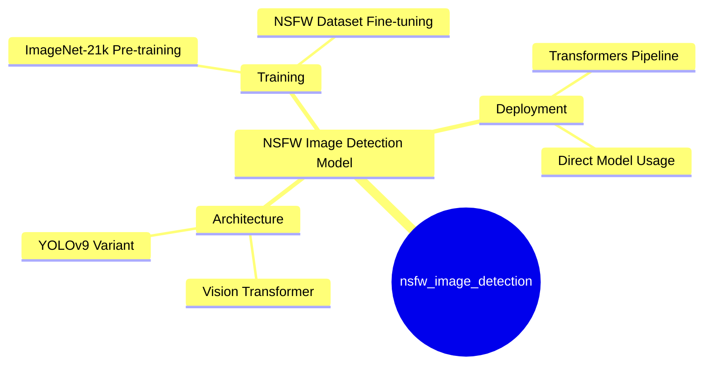
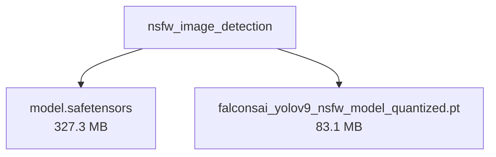

# Falconsai/nsfw_image_detection - Technical Documentation

**Author:** Falconsai  
**License:** apache-2.0  
**Last Modified:** 2025-04-06  
**HuggingFace URL:** [Falconsai/nsfw_image_detection](https://huggingface.co/Falconsai/nsfw_image_detection)


**Tags:** transformers, pytorch, safetensors, vit, image-classification, nsfw-detection, content-moderation

---

[Architecture](#architecture) • [Usage Guides](#usage-guides) • [Benchmarks](#performance--benchmarks) • [Variants](#model-variants) • [Limitations](#model-limitations--ethical-considerations) • [Conceptual Summary](#conceptual-summary) • [File Tree](#file-tree) • [Use Cases](#use-cases) • [Research Papers](#research-papers) • [Hyperparameters](#key-hyperparameters) • [GitHub](#github-repository) • [Training Info](#training-data--derivatives) • [Future Work](#future-work--roadmap) • [External Resources](#external-resources)

---

## Architecture

Based on the Vision Transformer (ViT) architecture, specifically the 'google/vit-base-patch16-224-in21k' variant. Images are processed in 16x16 pixel patches and encoded as a sequence of tokens. The model uses a transformer encoder to learn relationships between these patches for classification. The architecture includes both a ViT implementation and a YOLOv9 quantized version for optimized inference.

---

## Usage Guides

### Basic Classification with Transformers Pipeline
<p>Simple approach using Hugging Face's pipeline abstraction for quick image classification</p>
```python
from PIL import Image
from transformers import pipeline

img = Image.open("<path_to_image_file>")
classifier = pipeline("image-classification", model="Falconsai/nsfw_image_detection")
classifier(img)
```
### Direct Model Usage
<p>Lower-level approach loading the model and processor directly for more control over the inference process</p>
```python
import torch
from PIL import Image
from transformers import AutoModelForImageClassification, ViTImageProcessor

img = Image.open("<path_to_image_file>")
model = AutoModelForImageClassification.from_pretrained("Falconsai/nsfw_image_detection")
processor = ViTImageProcessor.from_pretrained('Falconsai/nsfw_image_detection')
with torch.no_grad():
    inputs = processor(images=img, return_tensors="pt")
    outputs = model(**inputs)
    logits = outputs.logits

predicted_label = logits.argmax(-1).item()
model.config.id2label[predicted_label]
```
<p style="font-style: italic; font-size: 0.9em; margin-top: 1em;">
Note: This wiki uses static Markdown. For interactive examples, please refer to the original
<a href="https://huggingface.co/Falconsai/nsfw_image_detection" target="_blank">Hugging Face model page</a> or the
<a href="" target="_blank">GitHub repository</a>.
</p>

---

## Performance & Benchmarks

### Model Evaluation Metrics
<p>Performance metrics from the evaluation dataset showing strong classification capability</p>
| Metric | Value |
|---|---|
| Accuracy | 98.04% |
| Loss | 0.0746 |
| Samples per second | 52.46 |
| Steps per second | 3.28 |

---

## Model Variants

| Model | Parameters | Base Architecture |
|-------|------------|-------------------|
| Base Model | N/A | N/A |

---

## Model Limitations & Ethical Considerations

### Limitations
<p>The model is specifically trained for binary classification of NSFW content and may not generalize well to other image classification tasks. Performance may vary depending on image quality and content type.</p>

### Ethical Considerations
<p>This model is intended for content moderation purposes and should be used responsibly in accordance with applicable regulations and content guidelines. Care should be taken to avoid bias in content filtering and respect privacy concerns.</p>

---

## Conceptual Summary

A Vision Transformer (ViT) model fine-tuned for NSFW image classification. The model uses a transformer encoder architecture adapted from BERT for image processing, pre-trained on ImageNet-21k and fine-tuned on a proprietary dataset of 80,000 images to classify content as either 'normal' or 'nsfw'. It achieves 98% accuracy on evaluation tasks.

### Model Design Flow (Mind Map)



---

## File Tree



### Files

| File | Size | Download |
|------|------|----------|
| `model.safetensors` | 327.3 MB | [Download](https://huggingface.co/Falconsai/nsfw_image_detection/resolve/main/model.safetensors) |
| `falconsai_yolov9_nsfw_model_quantized.pt` | 83.1 MB | [Download](https://huggingface.co/Falconsai/nsfw_image_detection/resolve/main/falconsai_yolov9_nsfw_model_quantized.pt) |

---

## Use Cases

- Content moderation systems for filtering explicit or inappropriate images
- NSFW content detection in social media platforms
- Automated content safety screening for user-generated content

---

## Research Papers

### An Image is Worth 16x16 Words: Transformers for Image Recognition at Scale

**URL:** [An Image is Worth 16x16 Words: Transformers for Image Recognition at Scale](https://arxiv.org/abs/2010.11929)

Introduces the Vision Transformer (ViT) architecture that directly applies transformers to image patches, achieving excellent results compared to CNNs while requiring less computational resources.

**Citation:**
```bibtex
@inproceedings{dosovitskiy2021image, title={An Image is Worth 16x16 Words: Transformers for Image Recognition at Scale}, author={Dosovitskiy, Alexey and Beyer, Lucas and Kolesnikov, Alexander and Weissenborn, Dirk and Zhai, Xiaohua and Unterthiner, Thomas and Dehghani, Mostafa and Minderer, Matthias and Heigold, Georg and Gelly, Sylvain and Uszkoreit, Jakob and Houlsby, Neil}, booktitle={International Conference on Learning Representations}, year={2021}}
```

---

---

## Key Hyperparameters

| Parameter | Value |
| :-------- | :---- |
| Learning Rate | 5e-5 |
| Batch Size | 16 |
| Image Resolution | 224x224 |

---

## GitHub Repository

**Repository:** []()  
**Stars:** 0 | **Forks:** 0 | **Issues:** 0  
**Created:**  | **Last Updated:** 


---

## Training Data & Derivatives

**Training Datasets:**
- `ImageNet-21k (pre-training)`
- `Proprietary NSFW dataset (80,000 images)`

**Model Derivatives & Training Adjustments:**
- Quantization Steps: 1

---

## Future Work & Roadmap

<p>Potential areas for improvement include expanding the training dataset for better coverage of edge cases, implementing multi-label classification for more granular content categorization, and reducing model size while maintaining accuracy.</p>

---

## External Resources

* **Additional Resources & Blog Posts:**
- [ImageNet Dataset](http://www.image-net.org/)
- [Vision Transformer Paper](https://arxiv.org/abs/2010.11929)
- [Hugging Face Model Hub](https://huggingface.co/models)

---

*This page was automatically generated using LLaMA 4.* 