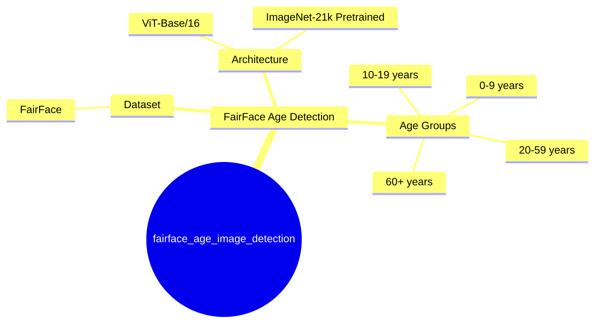
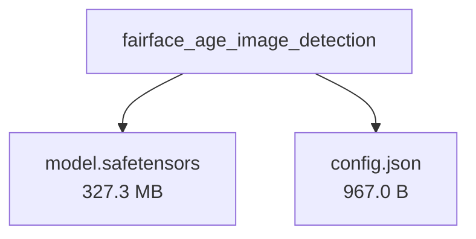

# dima806/fairface_age_image_detection - Technical Documentation

**Author:** dima806  
**License:** apache-2.0  
**Last Modified:** 2024-12-15  
**HuggingFace URL:** [dima806/fairface_age_image_detection](https://huggingface.co/dima806/fairface_age_image_detection)


**Tags:** transformers, vit, image-classification, age-detection, facial-analysis

---

[Architecture](#architecture) • [Usage Guides](#usage-guides) • [Benchmarks](#performance--benchmarks) • [Variants](#model-variants) • [Limitations](#model-limitations--ethical-considerations) • [Conceptual Summary](#conceptual-summary) • [File Tree](#file-tree) • [Use Cases](#use-cases) • [Research Papers](#research-papers) • [Hyperparameters](#key-hyperparameters) • [GitHub](#github-repository) • [Training Info](#training-data--derivatives) • [Future Work](#future-work--roadmap) • [External Resources](#external-resources)

---

## Architecture

The model uses the Vision Transformer (ViT) architecture with base configuration (ViT-B/16), featuring 16x16 pixel patches and pretrained on ImageNet-21k. It has been fine-tuned specifically for age group classification with 9 output classes.

---

## Usage Guides

### Basic Age Classification
<p>How to perform age group classification on facial images using the model</p>
```python
from transformers import AutoImageProcessor, AutoModelForImageClassification
from PIL import Image

processor = AutoImageProcessor.from_pretrained('dima806/fairface_age_image_detection')
model = AutoModelForImageClassification.from_pretrained('dima806/fairface_age_image_detection')

image = Image.open('face.jpg')
inputs = processor(image, return_tensors='pt')
predictions = model(**inputs)
labels = ['0-2', '3-9', '10-19', '20-29', '30-39', '40-49', '50-59', '60-69', 'more than 70']
```
<p style="font-style: italic; font-size: 0.9em; margin-top: 1em;">
Note: This wiki uses static Markdown. For interactive examples, please refer to the original
<a href="https://huggingface.co/dima806/fairface_age_image_detection" target="_blank">Hugging Face model page</a> or the
<a href="" target="_blank">GitHub repository</a>.
</p>

---

## Performance & Benchmarks

### Age Classification Performance
<p>Model performance across different age groups shows varying accuracy, with best performance in younger age groups (0-9 years) and declining accuracy in middle age ranges.</p>
| Age Group | Precision | Recall | F1-Score | Support |
|-----------|-----------|---------|-----------|----------|
| 0-2 | 0.7803 | 0.7500 | 0.7649 | 180 |
| 3-9 | 0.7998 | 0.7998 | 0.7998 | 1249 |
| 10-19 | 0.5361 | 0.4236 | 0.4733 | 1086 |
| 20-29 | 0.6402 | 0.7221 | 0.6787 | 3026 |
| 30-39 | 0.4935 | 0.5083 | 0.5008 | 2099 |
| 40-49 | 0.4848 | 0.4386 | 0.4606 | 1238 |
| 50-59 | 0.5000 | 0.4814 | 0.4905 | 725 |
| 60-69 | 0.4497 | 0.4685 | 0.4589 | 286 |
| >70 | 0.6897 | 0.1802 | 0.2857 | 111 |

---

## Model Variants

| Model | Parameters | Base Architecture |
|-------|------------|-------------------|
| Base Model | N/A | N/A |

---

## Model Limitations & Ethical Considerations

### Limitations
<p>The model shows reduced accuracy for middle-age groups (30-59) and very elderly subjects (>70). Performance varies significantly across age groups, with best results for young children (0-9 years) and declining accuracy for older age ranges.</p>

### Ethical Considerations
<p>As a facial analysis model, care should be taken to ensure fair and unbiased application across different demographic groups. The model's varying accuracy across age groups should be considered when deploying in real-world applications.</p>

---

## Conceptual Summary

A Vision Transformer (ViT) model fine-tuned for age group classification from facial images, achieving approximately 59% accuracy across 9 age groups. The model is based on google/vit-base-patch16-224-in21k and trained on the FairFace dataset to provide fair and balanced age predictions across different demographics.

### Model Design Flow (Mind Map)



---

## File Tree



### Files

| File | Size | Download |
|------|------|----------|
| `model.safetensors` | 327.3 MB | [Download](https://huggingface.co/dima806/fairface_age_image_detection/resolve/main/model.safetensors) |
| `config.json` | 967.0 B | [Download](https://huggingface.co/dima806/fairface_age_image_detection/resolve/main/config.json) |

---

## Use Cases

- Age group classification from facial images for demographic analysis
- Fair and balanced age estimation across different ethnic groups
- Automated age verification systems

---

## Research Papers

*No research papers available.*

---

## Key Hyperparameters

| Parameter | Value |
| :-------- | :---- |
| Model Type | ViT-Base/16 |
| Image Size | 224x224 |
| Number of Classes | 9 |

---

## GitHub Repository

**Repository:** []()  
**Stars:** 0 | **Forks:** 0 | **Issues:** 0  
**Created:**  | **Last Updated:** 


---

## Training Data & Derivatives

**Training Datasets:**
- `nateraw/fairface`


---

## Future Work & Roadmap

<p>Potential improvements could focus on increasing accuracy for middle-age and elderly age groups, where the model currently shows lower performance. Additional training data for underrepresented age groups could help balance performance.</p>

---

## External Resources

* **Additional Resources & Blog Posts:**
- [Kaggle Notebook](https://www.kaggle.com/code/dima806/age-group-image-classification-vit)

---

*This page was automatically generated using LLaMA 4.* 