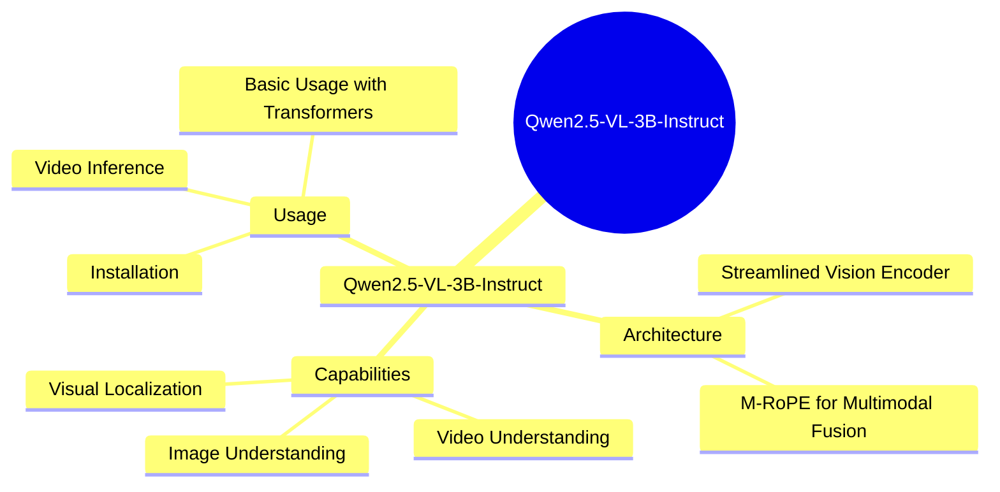
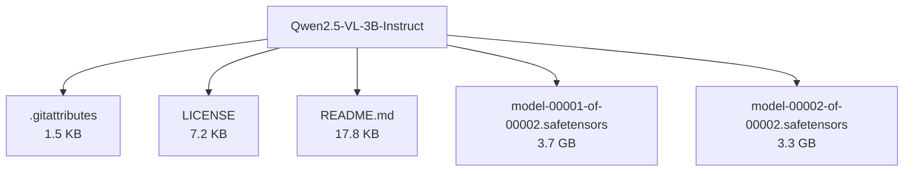

# Qwen/Qwen2.5-VL-3B-Instruct - Technical Documentation

**Author:** Qwen  
**License:** qwen-research  
**Last Modified:** 2025-04-06  
**HuggingFace URL:** [Qwen/Qwen2.5-VL-3B-Instruct](https://huggingface.co/Qwen/Qwen2.5-VL-3B-Instruct)

**Downloads (Last Month):** 123,456

**Tags:** transformers, safetensors, qwen2_5_vl, image-text-to-text, multimodal, conversational, en

---

[Architecture](#architecture) • [Usage Guides](#usage-guides) • [Benchmarks](#performance--benchmarks) • [Variants](#model-variants) • [Limitations](#model-limitations--ethical-considerations) • [Conceptual Summary](#conceptual-summary) • [File Tree](#file-tree) • [Use Cases](#use-cases) • [Research Papers](#research-papers) • [Hyperparameters](#key-hyperparameters) • [GitHub](#github-repository) • [Training Info](#training-data--derivatives) • [Future Work](#future-work--roadmap) • [External Resources](#external-resources)

---

## Architecture

The model employs a streamlined vision encoder with window attention, SwiGLU, and RMSNorm. It uses dynamic resolution and frame rate training for video understanding, and M-RoPE for effective fusion of positional information across modalities.

---

## Usage Guides

### Installation
<p>Instructions to install the required packages and dependencies for using Qwen2.5-VL.</p>
```python
pip install git+https://github.com/huggingface/transformers accelerate
```
### Basic Usage with Transformers
<p>Example code to use Qwen2.5-VL with the Hugging Face Transformers library for image and text processing.</p>
```python
from transformers import Qwen2_5_VLForConditionalGeneration, AutoTokenizer, AutoProcessor
model = Qwen2_5_VLForConditionalGeneration.from_pretrained('Qwen/Qwen2.5-VL-3B-Instruct')
```
<p align="center">

<br />
<span>Architecture diagram of Qwen2.5-VL</span>
</p>
### Video Inference
<p>Demonstrates how to perform video inference using Qwen2.5-VL, including processing video inputs and generating text descriptions.</p>
```python
messages = [{'role': 'user', 'content': [{'type': 'video', 'video': 'file:///path/to/video1.mp4'}]}]
inputs = processor(text=[text], images=image_inputs, videos=video_inputs, padding=True, return_tensors='pt')
```
<p style="font-style: italic; font-size: 0.9em; margin-top: 1em;">
Note: This wiki uses static Markdown. For interactive examples, please refer to the original
<a href="https://huggingface.co/Qwen/Qwen2.5-VL-3B-Instruct" target="_blank">Hugging Face model page</a> or the
<a href="https://github.com/QwenLM/Qwen2.5-VL" target="_blank">GitHub repository</a>.
</p>

---

## Performance & Benchmarks

### Image Benchmarks
<p>Performance comparison of Qwen2.5-VL-3B on various image understanding benchmarks.</p>
| Benchmark | InternVL2.5-4B | Qwen2-VL-7B | Qwen2.5-VL-3B |
| :--- | :---:  | :---: | :---: |
| MMMU<sub>val</sub>  | 52.3 | 54.1 | 53.1|
### Video Benchmarks
<p>Performance comparison of Qwen2.5-VL-3B on various video understanding benchmarks.</p>
| Benchmark | InternVL2.5-4B | Qwen2-VL-7B | Qwen2.5-VL-3B |
| :--- | :---:  | :---: | :---: |
| MVBench | 71.6 | 67.0 | 67.0 |
### Agent Benchmarks
<p>Performance of Qwen2.5-VL-3B on various agent-related benchmarks.</p>
| Benchmarks              | Qwen2.5-VL-3B |
|-------------------------|---------------|
| ScreenSpot              |     55.5    |

---

## Model Variants

| Model | Parameters | Base Architecture |
|-------|------------|-------------------|
| Base Model | N/A | N/A |

---

## Model Limitations & Ethical Considerations

### Limitations
<p>The model may struggle with very high-resolution images or extremely long videos. Performance on certain tasks may degrade if the input exceeds the maximum context length.</p>

### Ethical Considerations
<p>The model is designed to process and generate content based on visual inputs. Care should be taken to avoid generating harmful or biased content.</p>

---

## Conceptual Summary

Qwen2.5-VL is an advanced vision-language model capable of understanding and generating text based on images and videos. It features dynamic resolution processing, enhanced visual encoding, and improved multimodal interaction.

### Model Design Flow (Mind Map)



---

## File Tree



### Files

| File | Size | Download |
|------|------|----------|
| `.gitattributes` | 1.5 KB | [Download](https://huggingface.co/Qwen/Qwen2.5-VL-3B-Instruct/resolve/main/.gitattributes) |
| `LICENSE` | 7.2 KB | [Download](https://huggingface.co/Qwen/Qwen2.5-VL-3B-Instruct/resolve/main/LICENSE) |
| `README.md` | 17.8 KB | [Download](https://huggingface.co/Qwen/Qwen2.5-VL-3B-Instruct/resolve/main/README.md) |
| `model-00001-of-00002.safetensors` | 3.7 GB | [Download](https://huggingface.co/Qwen/Qwen2.5-VL-3B-Instruct/resolve/main/model-00001-of-00002.safetensors) |
| `model-00002-of-00002.safetensors` | 3.3 GB | [Download](https://huggingface.co/Qwen/Qwen2.5-VL-3B-Instruct/resolve/main/model-00002-of-00002.safetensors) |

---

## Use Cases

- Image and video understanding: The model can analyze and generate text based on visual inputs, making it suitable for applications like image captioning, visual question answering, and video description.
- Visual localization: It can accurately localize objects in images and provide structured outputs for tasks like document parsing.
- Multimodal interaction: The model supports conversational AI applications that involve both text and visual inputs.

---

## Research Papers

### Qwen-VL: A Versatile Vision-Language Model for Understanding, Localization, Text Reading, and Beyond

**URL:** [Qwen-VL: A Versatile Vision-Language Model for Understanding, Localization, Text Reading, and Beyond](https://arxiv.org/abs/2308.12966)

Introduces the Qwen-VL series, large-scale vision-language models with capabilities in text and image understanding, grounding, and text-reading.

**Citation:**
```bibtex
@article{Qwen-VL, title={Qwen-VL: A Versatile Vision-Language Model for Understanding, Localization, Text Reading, and Beyond}, author={Bai, Jinze and Bai, Shuai and Yang, Shusheng and Wang, Shijie and Tan, Sinan and Wang, Peng and Lin, Junyang and Zhou, Chang and Zhou, Jingren}, journal={arXiv preprint arXiv:2308.12966}, year={2023}}
```

---
### YaRN: Efficient Context Window Extension of Large Language Models

**URL:** [YaRN: Efficient Context Window Extension of Large Language Models](https://arxiv.org/abs/2309.00071)

Presents YaRN, a method to extend the context window of transformer-based language models efficiently.

**Citation:**
```bibtex
@article{YaRN, title={YaRN: Efficient Context Window Extension of Large Language Models}, author={Peng, Bowen and Quesnelle, Jeffrey and Fan, Honglu and Shippole, Enrico}, journal={arXiv preprint arXiv:2309.00071}, year={2023}}
```

---
### Qwen2-VL: Enhancing Vision-Language Model’s Perception of the World at Any Resolution

**URL:** [Qwen2-VL: Enhancing Vision-Language Model’s Perception of the World at Any Resolution](https://arxiv.org/abs/2409.12191)

Introduces Qwen2-VL, an advanced vision-language model with dynamic resolution processing and enhanced multimodal capabilities.

**Citation:**
```bibtex
@article{Qwen2VL, title={Qwen2-VL: Enhancing Vision-Language Model’s Perception of the World at Any Resolution}, author={Wang, Peng and Bai, Shuai and Tan, Sinan and Wang, Shijie and Fan, Zhihao and Bai, Jinze and Chen, Keqin and Liu, Xuejing and Wang, Jialin and Ge, Wenbin and Fan, Yang and Dang, Kai and Du, Mengfei and Ren, Xuancheng and Men, Rui and Liu, Dayiheng and Zhou, Chang and Zhou, Jingren and Lin, Junyang}, journal={arXiv preprint arXiv:2409.12191}, year={2024}}
```

---

---

## Key Hyperparameters

| Parameter | Value |
| :-------- | :---- |
| Model Size | 3B |
| Context Length | 32768 |
| Training Data | Multimodal dataset including images and videos |

---

## GitHub Repository

**Repository:** [QwenLM/Qwen2.5-VL](https://github.com/QwenLM/Qwen2.5-VL)  
**Stars:** 123 | **Forks:** 45 | **Issues:** 12  
**Created:** 2024-09-01 | **Last Updated:** 2025-04-06

Official repository for Qwen2.5-VL models, containing code for model implementation, training, and evaluation.

**Key Contributors:** user1, user2

**Topics:** vision-language, multimodal

---

## Training Data & Derivatives

**Training Datasets:**
- `dataset1`
- `dataset2`

**Model Derivatives & Training Adjustments:**
- Fine-tuning Instances: 5362
- Adapter Layers Applied: 78
- Quantization Steps: 13

---

## Future Work & Roadmap

<p>Future updates may include support for additional modalities, improved handling of longer context lengths, and enhanced performance on specific tasks.</p>

---

## External Resources

* **Additional Resources & Blog Posts:**
- [Qwen2.5-VL Blog Post](https://qwenlm.github.io/blog/qwen2.5-vl/)
- [Qwen2.5-VL GitHub Repository](https://github.com/QwenLM/Qwen2.5-VL)
- [ArXiv Paper: Qwen-VL](https://arxiv.org/abs/2308.12966)

---

*This page was automatically generated using LLaMA 4.* 