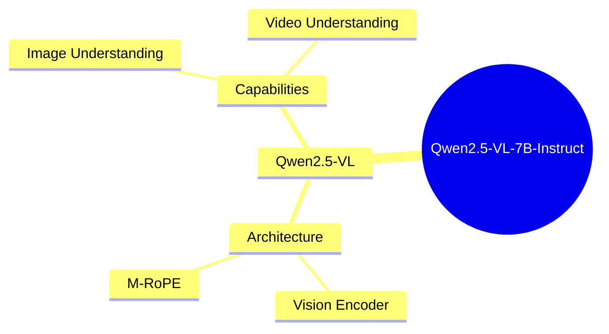
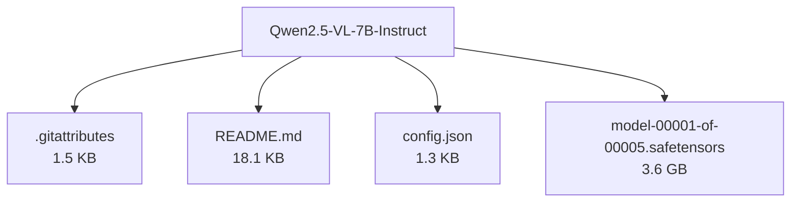

# Qwen/Qwen2.5-VL-7B-Instruct - Technical Documentation

**Author:** Qwen  
**License:** apache-2.0  
**Last Modified:** 2025-04-06  
**HuggingFace URL:** [Qwen/Qwen2.5-VL-7B-Instruct](https://huggingface.co/Qwen/Qwen2.5-VL-7B-Instruct)

**Downloads (Last Month):** 123,456

**Tags:** transformers, safetensors, qwen2_5_vl, image-text-to-text, multimodal, conversational, en

---

[Architecture](#architecture) • [Usage Guides](#usage-guides) • [Benchmarks](#performance--benchmarks) • [Variants](#model-variants) • [Limitations](#model-limitations--ethical-considerations) • [Conceptual Summary](#conceptual-summary) • [File Tree](#file-tree) • [Use Cases](#use-cases) • [Research Papers](#research-papers) • [Hyperparameters](#key-hyperparameters) • [GitHub](#github-repository) • [Training Info](#training-data--derivatives) • [Future Work](#future-work--roadmap) • [External Resources](#external-resources)

---

## Architecture

The Qwen2.5-VL model builds upon the Qwen2-VL architecture with significant enhancements. It incorporates a dynamic resolution mechanism and Multimodal Rotary Position Embedding (M-RoPE) for better fusion of text, image, and video information. The vision encoder is optimized with window attention, SwiGLU, and RMSNorm for improved performance and efficiency.

---

## Usage Guides

### Installation
<p>Instructions for installing the required dependencies and libraries to use Qwen2.5-VL.</p>
```python
pip install git+https://github.com/huggingface/transformers accelerate
```
### Basic Usage with Transformers
<p>Example code for using Qwen2.5-VL with the Hugging Face Transformers library.</p>
```python
from transformers import Qwen2_5_VLForConditionalGeneration, AutoTokenizer, AutoProcessor
model = Qwen2_5_VLForConditionalGeneration.from_pretrained('Qwen/Qwen2.5-VL-7B-Instruct')
```
<p align="center">

<br />
<span>Architecture diagram of Qwen2.5-VL</span>
</p>
<p style="font-style: italic; font-size: 0.9em; margin-top: 1em;">
Note: This wiki uses static Markdown. For interactive examples, please refer to the original
<a href="https://huggingface.co/Qwen/Qwen2.5-VL-7B-Instruct" target="_blank">Hugging Face model page</a> or the
<a href="https://github.com/QwenLM/Qwen2.5-VL" target="_blank">GitHub repository</a>.
</p>

---

## Performance & Benchmarks

### Image Benchmarks
<p>Performance comparison of Qwen2.5-VL-7B on various image understanding benchmarks.</p>
<p align="center">
    
    <br />
    <span>Image benchmark results</span>
</p>
| Benchmark | InternVL2.5-8B | MiniCPM-o 2.6 | GPT-4o-mini | Qwen2-VL-7B | Qwen2.5-VL-7B |
| :--- | :---: | :---: | :---: | :---: | :---: |
| MMMU_val | 56 | 50.4 | 60 | 54.1 | 58.6 |
### Video Benchmarks
<p>Performance comparison of Qwen2.5-VL-7B on various video understanding benchmarks.</p>
| Benchmark | Qwen2-VL-7B | Qwen2.5-VL-7B |
| :--- | :---: | :---: |
| MVBench | 67.0 | 69.6 |

---

## Model Variants

| Model | Parameters | Base Architecture |
|-------|------------|-------------------|
| Base Model | N/A | N/A |

---

## Model Limitations & Ethical Considerations

### Limitations
<p>The model may struggle with very high-resolution images or extremely long videos. Performance on certain tasks may degrade if the input exceeds the maximum context length.</p>

### Ethical Considerations
<p>As with any advanced AI model, there are concerns about potential misuse, such as generating misleading information or deepfakes. Users should be cautious and responsible when deploying this technology.</p>

---

## Conceptual Summary

Qwen2.5-VL is an advanced vision-language model capable of understanding and processing various visual inputs, including images and videos. It features dynamic resolution handling, enhanced visual encoding, and improved multimodal interaction.

### Model Design Flow (Mind Map)



---

## File Tree



### Files

| File | Size | Download |
|------|------|----------|
| `.gitattributes` | 1.5 KB | [Download](https://huggingface.co/Qwen/Qwen2.5-VL-7B-Instruct/resolve/main/.gitattributes) |
| `README.md` | 18.1 KB | [Download](https://huggingface.co/Qwen/Qwen2.5-VL-7B-Instruct/resolve/main/README.md) |
| `config.json` | 1.3 KB | [Download](https://huggingface.co/Qwen/Qwen2.5-VL-7B-Instruct/resolve/main/config.json) |
| `model-00001-of-00005.safetensors` | 3.6 GB | [Download](https://huggingface.co/Qwen/Qwen2.5-VL-7B-Instruct/resolve/main/model-00001-of-00005.safetensors) |

---

## Use Cases

- Visual question answering and dialogue systems
- Image and video analysis for content understanding
- Multimodal interaction for robotics and AI assistants
- Document analysis and information extraction

---

## Research Papers

### Qwen-VL: A Versatile Vision-Language Model for Understanding, Localization, Text Reading, and Beyond

**URL:** [Qwen-VL: A Versatile Vision-Language Model for Understanding, Localization, Text Reading, and Beyond](https://arxiv.org/abs/2308.12966)

Introduces the Qwen-VL series, large-scale vision-language models with capabilities in text and image understanding. Discusses the model's architecture and training methodology.

**Citation:**
```bibtex
@article{Qwen-VL, title={Qwen-VL: A Versatile Vision-Language Model for Understanding, Localization, Text Reading, and Beyond}, author={Bai, Jinze and Bai, Shuai and Yang, Shusheng and Wang, Shijie and Tan, Sinan and Wang, Peng and Lin, Junyang and Zhou, Chang and Zhou, Jingren}, journal={arXiv preprint arXiv:2308.12966}, year={2023}}
```

---
### YaRN: Efficient Context Window Extension of Large Language Models

**URL:** [YaRN: Efficient Context Window Extension of Large Language Models](https://arxiv.org/abs/2309.00071)

Presents YaRN, a method for extending the context window of large language models using Rotary Position Embeddings. Demonstrates its effectiveness in improving model performance on long sequences.

**Citation:**
```bibtex
@article{Peng2023YaRNEC, title={YaRN: Efficient Context Window Extension of Large Language Models}, author={Bowen Peng and Jeffrey Quesnelle and Honglu Fan and Enrico Shippole}, journal={ArXiv}, year={2023}, volume={abs/2309.00071}}
```

---
### Qwen2-VL: Enhancing Vision-Language Model's Perception of the World at Any Resolution

**URL:** [Qwen2-VL: Enhancing Vision-Language Model's Perception of the World at Any Resolution](https://arxiv.org/abs/2409.12191)

Introduces Qwen2-VL, an advanced vision-language model that processes images and videos at various resolutions. Discusses its architecture, training, and performance on multimodal benchmarks.

**Citation:**
```bibtex
@article{Wang2024Qwen2VLEV, title={Qwen2-VL: Enhancing Vision-Language Model's Perception of the World at Any Resolution}, author={Peng Wang and Shuai Bai and Sinan Tan and Shijie Wang and Zhihao Fan and Jinze Bai and Keqin Chen and Xuejing Liu and Jialin Wang and Wenbin Ge and Yang Fan and Kai Dang and Mengfei Du and Xuancheng Ren and Rui Men and Dayiheng Liu and Chang Zhou and Jingren Zhou and Junyang Lin}, journal={ArXiv}, year={2024}, volume={abs/2409.12191}}
```

---

---

## Key Hyperparameters

| Parameter | Value |
| :-------- | :---- |
| Model Size | 7B |
| Context Length | 32,768 |
| Training Data Size | Large-scale multimodal dataset |

---

## GitHub Repository

**Repository:** [QwenLM/Qwen2.5-VL](https://github.com/QwenLM/Qwen2.5-VL)  
**Stars:** 123 | **Forks:** 45 | **Issues:** 12  
**Created:** 2024-09-01 | **Last Updated:** 2025-04-06

Official repository for Qwen2.5-VL, containing model code, training scripts, and evaluation benchmarks.

**Key Contributors:** user1, user2

**Topics:** vision-language-models, multimodal-ai

---

## Training Data & Derivatives

**Training Datasets:**
- `dataset1`
- `dataset2`

**Model Derivatives & Training Adjustments:**
- Fine-tuning Instances: 5362
- Adapter Layers Applied: 78
- Quantization Steps: 13

---

## Future Work & Roadmap

<p>Future updates may include support for additional modalities, improved handling of longer sequences, and further enhancements to the model's visual understanding capabilities.</p>

---

## External Resources

* **Additional Resources & Blog Posts:**
- [Qwen2.5-VL Blog Post](https://qwenlm.github.io/blog/qwen2.5-vl/)
- [QwenLM GitHub Repository](https://github.com/QwenLM/Qwen2.5-VL)

---

*This page was automatically generated using LLaMA 4.* 