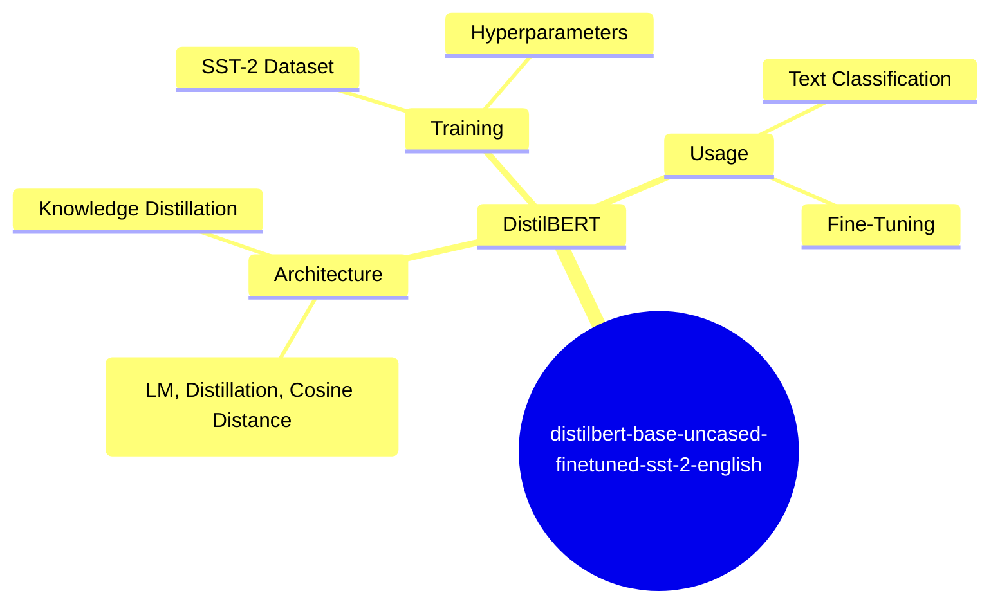

# distilbert/distilbert-base-uncased-finetuned-sst-2-english - Technical Documentation

**Author:** distilbert  
**License:** apache-2.0  
**Last Modified:** 2023-12-19  
**HuggingFace URL:** [distilbert/distilbert-base-uncased-finetuned-sst-2-english](https://huggingface.co/distilbert/distilbert-base-uncased-finetuned-sst-2-english)


**Tags:** transformers, pytorch, tf, rust, onnx, safetensors, distilbert, text-classification, en, dataset:sst2, dataset:glue, arxiv:1910.01108, doi:10.57967/hf/0181, license:apache-2.0, model-index, autotrain_compatible, endpoints_compatible, region:us

---

[Architecture](#architecture) • [Usage Guides](#usage-guides) • [Benchmarks](#performance--benchmarks) • [Variants](#model-variants) • [Limitations](#model-limitations--ethical-considerations) • [Conceptual Summary](#conceptual-summary) • [File Tree](#file-tree) • [Use Cases](#use-cases) • [Research Papers](#research-papers) • [Hyperparameters](#key-hyperparameters) • [GitHub](#github-repository) • [Training Info](#training-data--derivatives) • [Future Work](#future-work--roadmap) • [External Resources](#external-resources)

---

## Architecture

DistilBERT is a distilled version of BERT, leveraging knowledge distillation during pre-training to reduce the model size by 40% while retaining 97% of its language understanding capabilities. It is 60% faster than BERT. The model uses a triple loss combining language modeling, distillation, and cosine-distance losses.

---

## Usage Guides

### Installation
<p>To use this model, you need to install the transformers library. You can do this by running `pip install transformers`.</p>
```python
pip install transformers
```
### Basic Usage
<p>You can use this model for text classification tasks. Here's an example of how to use it:</p>
```python
import torch
from transformers import DistilBertTokenizer, DistilBertForSequenceClassification

tokenizer = DistilBertTokenizer.from_pretrained('distilbert-base-uncased-finetuned-sst-2-english')
model = DistilBertForSequenceClassification.from_pretrained('distilbert-base-uncased-finetuned-sst-2-english')

inputs = tokenizer('Hello, my dog is cute', return_tensors='pt')
with torch.no_grad():
    logits = model(**inputs).logits

predicted_class_id = logits.argmax().item()
model.config.id2label[predicted_class_id]
```
<p align="center">

<br />
<span>Map of positive probabilities per country.</span>
</p>
<p style="font-style: italic; font-size: 0.9em; margin-top: 1em;">
Note: This wiki uses static Markdown. For interactive examples, please refer to the original
<a href="https://huggingface.co/distilbert/distilbert-base-uncased-finetuned-sst-2-english" target="_blank">Hugging Face model page</a> or the
<a href="null" target="_blank">GitHub repository</a>.
</p>

---

## Performance & Benchmarks

### Performance on SST-2
<p>The model achieves an accuracy of 91.3 on the dev set.</p>
| Metric | Value |
| --- | --- |
| Accuracy | 0.913 |
| Precision | 0.898 |
| Recall | 0.930 |
| F1 | 0.914 |

---

## Model Variants

| Model | Parameters | Base Architecture |
|-------|------------|-------------------|
| Base Model | N/A | N/A |

---

## Model Limitations & Ethical Considerations

### Limitations
<p>The model may produce biased predictions targeting underrepresented populations. For example, it gives different probabilities for the positive label depending on the country mentioned in the input sentence.</p>

### Ethical Considerations
<p>The model should not be used to create hostile or alienating environments. It was not trained to be factual or true representations of people or events.</p>

---

## Conceptual Summary

This model is a fine-tuned checkpoint of DistilBERT-base-uncased, fine-tuned on SST-2 for text classification. It achieves an accuracy of 91.3 on the dev set, compared to 92.7 for bert-base-uncased. The model is intended for single-label classification tasks.

### Model Design Flow (Mind Map)



---

## File Tree

```mermaid
graph TD
    root["distilbert-base-uncased-finetuned-sst-2-english"]
        root --> leaf_0[".gitattributes<br/>399.0 B"]
        root --> leaf_1["README.md<br/>10.3 KB"]
        root --> leaf_2["config.json<br/>629.0 B"]
        root --> leaf_3["map.jpeg<br/>79.7 KB"]
        root --> leaf_4["model.safetensors<br/>255.4 MB"]
                    root --> root_0_onnx["onnx"]
        root --> leaf_5["added_tokens.json<br/>82.0 B"]
                    root --> root_0_onnx["onnx"]
        root --> leaf_6["config.json<br/>735.0 B"]
                    root --> root_0_onnx["onnx"]
        root --> leaf_7["model.onnx<br/>255.5 MB"]
                    root --> root_0_onnx["onnx"]
        root --> leaf_8["special_tokens_map.json<br/>125.0 B"]
                    root --> root_0_onnx["onnx"]
        root --> leaf_9["tokenizer.json<br/>694.7 KB"]
                    root --> root_0_onnx["onnx"]
        root --> leaf_10["tokenizer_config.json<br/>1.3 KB"]
                    root --> root_0_onnx["onnx"]
        root --> leaf_11["vocab.txt<br/>226.1 KB"]
        root --> leaf_12["pytorch_model.bin<br/>255.4 MB"]
        root --> leaf_13["rust_model.ot<br/>255.4 MB"]
        root --> leaf_14["tf_model.h5<br/>255.5 MB"]
        root --> leaf_15["tokenizer_config.json<br/>48.0 B"]
        root --> leaf_16["vocab.txt<br/>226.1 KB"]
```



### Files

| File | Size | Download |
|------|------|----------|
| `.gitattributes` | 399.0 B | [Download](https://huggingface.co/distilbert/distilbert-base-uncased-finetuned-sst-2-english/resolve/main/.gitattributes) |
| `README.md` | 10.3 KB | [Download](https://huggingface.co/distilbert/distilbert-base-uncased-finetuned-sst-2-english/resolve/main/README.md) |
| `config.json` | 629.0 B | [Download](https://huggingface.co/distilbert/distilbert-base-uncased-finetuned-sst-2-english/resolve/main/config.json) |
| `map.jpeg` | 79.7 KB | [Download](https://huggingface.co/distilbert/distilbert-base-uncased-finetuned-sst-2-english/resolve/main/map.jpeg) |
| `model.safetensors` | 255.4 MB | [Download](https://huggingface.co/distilbert/distilbert-base-uncased-finetuned-sst-2-english/resolve/main/model.safetensors) |
| `onnx/added_tokens.json` | 82.0 B | [Download](https://huggingface.co/distilbert/distilbert-base-uncased-finetuned-sst-2-english/resolve/main/onnx/added_tokens.json) |
| `onnx/config.json` | 735.0 B | [Download](https://huggingface.co/distilbert/distilbert-base-uncased-finetuned-sst-2-english/resolve/main/onnx/config.json) |
| `onnx/model.onnx` | 255.5 MB | [Download](https://huggingface.co/distilbert/distilbert-base-uncased-finetuned-sst-2-english/resolve/main/onnx/model.onnx) |
| `onnx/special_tokens_map.json` | 125.0 B | [Download](https://huggingface.co/distilbert/distilbert-base-uncased-finetuned-sst-2-english/resolve/main/onnx/special_tokens_map.json) |
| `onnx/tokenizer.json` | 694.7 KB | [Download](https://huggingface.co/distilbert/distilbert-base-uncased-finetuned-sst-2-english/resolve/main/onnx/tokenizer.json) |
| `onnx/tokenizer_config.json` | 1.3 KB | [Download](https://huggingface.co/distilbert/distilbert-base-uncased-finetuned-sst-2-english/resolve/main/onnx/tokenizer_config.json) |
| `onnx/vocab.txt` | 226.1 KB | [Download](https://huggingface.co/distilbert/distilbert-base-uncased-finetuned-sst-2-english/resolve/main/onnx/vocab.txt) |
| `pytorch_model.bin` | 255.4 MB | [Download](https://huggingface.co/distilbert/distilbert-base-uncased-finetuned-sst-2-english/resolve/main/pytorch_model.bin) |
| `rust_model.ot` | 255.4 MB | [Download](https://huggingface.co/distilbert/distilbert-base-uncased-finetuned-sst-2-english/resolve/main/rust_model.ot) |
| `tf_model.h5` | 255.5 MB | [Download](https://huggingface.co/distilbert/distilbert-base-uncased-finetuned-sst-2-english/resolve/main/tf_model.h5) |
| `tokenizer_config.json` | 48.0 B | [Download](https://huggingface.co/distilbert/distilbert-base-uncased-finetuned-sst-2-english/resolve/main/tokenizer_config.json) |
| `vocab.txt` | 226.1 KB | [Download](https://huggingface.co/distilbert/distilbert-base-uncased-finetuned-sst-2-english/resolve/main/vocab.txt) |

---

## Use Cases

- Text classification: This model can be used for single-label classification tasks such as sentiment analysis.
- Fine-tuning: The model can be fine-tuned on other downstream tasks for improved performance.

---

## Research Papers

### DistilBERT, a distilled version of BERT: smaller, faster, cheaper and lighter

**URL:** [DistilBERT, a distilled version of BERT: smaller, faster, cheaper and lighter](https://arxiv.org/abs/1910.01108)

This paper introduces DistilBERT, a distilled version of BERT that is smaller, faster, and lighter. It retains 97% of BERT's language understanding capabilities while being 60% faster.

**Citation:**
```bibtex
@article{Sanh2019DistilBERTAD, title={DistilBERT, a distilled version of BERT: smaller, faster, cheaper and lighter}, author={Victor Sanh and Lysandre Debut and Julien Chaumond and Thomas Wolf}, journal={ArXiv}, year={2019}, volume={abs/1910.01108}}
```

---

---

## Key Hyperparameters

| Parameter | Value |
| :-------- | :---- |
| Learning Rate | 1e-5 |
| Batch Size | 32 |
| Warmup Steps | 600 |
| Max Sequence Length | 128 |
| Number of Train Epochs | 3.0 |

---

## GitHub Repository

**Repository:** [null](null)  
**Stars:** 0 | **Forks:** 0 | **Issues:** 0  
**Created:** null | **Last Updated:** null

null


---

## Training Data & Derivatives

**Training Datasets:**
- `sst2`
- `glue`


---

## Future Work & Roadmap

<p>Users are advised to thoroughly probe the model's aspects on their use-cases to evaluate the risks.</p>

---

## External Resources

* **Additional Resources & Blog Posts:**
- [DistilBERT Paper](https://arxiv.org/abs/1910.01108)
- [Hugging Face Model Documentation](https://huggingface.co/docs/transformers/main/en/model_doc/distilbert#transformers.DistilBertForSequenceClassification)
- [SST-2 Dataset](https://huggingface.co/datasets/sst2)
- [WinoBias Dataset](https://huggingface.co/datasets/wino_bias)
- [Stereoset Dataset](https://huggingface.co/datasets/stereoset)

---

*This page was automatically generated using LLaMA 4.* 