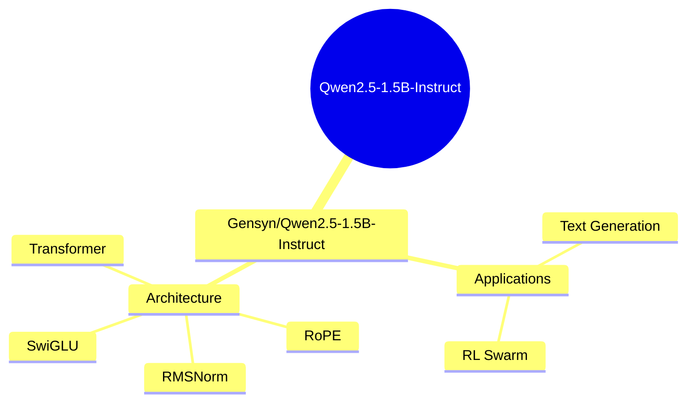
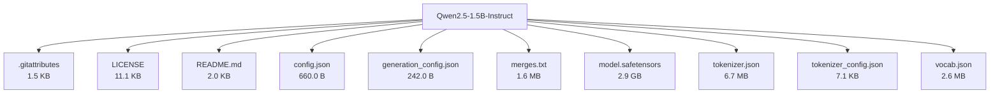

# Gensyn/Qwen2.5-1.5B-Instruct - Technical Documentation

**Author:** Gensyn  
**License:** apache-2.0  
**Last Modified:** 2025-04-04  
**HuggingFace URL:** [Gensyn/Qwen2.5-1.5B-Instruct](https://huggingface.co/Gensyn/Qwen2.5-1.5B-Instruct)


**Tags:** transformers, safetensors, qwen2, text-generation, chat, rl-swarm, gensyn, conversational, en

---

[Architecture](#architecture) • [Usage Guides](#usage-guides) • [Benchmarks](#performance--benchmarks) • [Variants](#model-variants) • [Limitations](#model-limitations--ethical-considerations) • [Conceptual Summary](#conceptual-summary) • [File Tree](#file-tree) • [Use Cases](#use-cases) • [Research Papers](#research-papers) • [Hyperparameters](#key-hyperparameters) • [GitHub](#github-repository) • [Training Info](#training-data--derivatives) • [Future Work](#future-work--roadmap) • [External Resources](#external-resources)

---

## Architecture

The model uses a transformer architecture with 28 layers, 12 attention heads for Q, and 2 for KV. It has 1.54B parameters and supports a context length of 32,768 tokens. The architecture was chosen for its ability to handle long-range dependencies and complex language understanding tasks.

---

## Usage Guides

### Installation
<p>To use this model, install the required libraries by following the instructions in the RL Swarm repository.</p>
```python
pip install transformers
# Additional installation steps as per RL Swarm repository
```
### Basic Usage
<p>Load the model using the transformers library and perform text generation tasks.</p>
```python
from transformers import AutoModelForCausalLM, AutoTokenizer
model = AutoModelForCausalLM.from_pretrained('Gensyn/Qwen2.5-1.5B-Instruct')
tokenizer = AutoTokenizer.from_pretrained('Gensyn/Qwen2.5-1.5B-Instruct')
# Generate text using the model
```
<p style="font-style: italic; font-size: 0.9em; margin-top: 1em;">
Note: This wiki uses static Markdown. For interactive examples, please refer to the original
<a href="https://huggingface.co/Gensyn/Qwen2.5-1.5B-Instruct" target="_blank">Hugging Face model page</a> or the
<a href="https://github.com/gensyn-ai/rl-swarm" target="_blank">GitHub repository</a>.
</p>

---

## Performance & Benchmarks

| Dataset | Metric | Value | Notes |
|---------|--------|-------|-------|
| No benchmark data yet | - | - | - |

---

## Model Variants

| Model | Parameters | Base Architecture |
|-------|------------|-------------------|
| Base Model | N/A | N/A |

---

## Model Limitations & Ethical Considerations

### Limitations
<p>The model is primarily designed for use within the Gensyn RL Swarm system. Its performance outside this context may vary.</p>

*No specific ethical considerations documented.*

---

## Conceptual Summary

This model is an unmodified version of the instruction-tuned 1.5B Qwen2.5 model, intended for use in the Gensyn RL Swarm for finetuning via peer-to-peer reinforcement learning. It features a transformer architecture with RoPE, SwiGLU, RMSNorm, and tied word embeddings.

### Model Design Flow (Mind Map)



---

## File Tree



### Files

| File | Size | Download |
|------|------|----------|
| `.gitattributes` | 1.5 KB | [Download](https://huggingface.co/Gensyn/Qwen2.5-1.5B-Instruct/resolve/main/.gitattributes) |
| `LICENSE` | 11.1 KB | [Download](https://huggingface.co/Gensyn/Qwen2.5-1.5B-Instruct/resolve/main/LICENSE) |
| `README.md` | 2.0 KB | [Download](https://huggingface.co/Gensyn/Qwen2.5-1.5B-Instruct/resolve/main/README.md) |
| `config.json` | 660.0 B | [Download](https://huggingface.co/Gensyn/Qwen2.5-1.5B-Instruct/resolve/main/config.json) |
| `generation_config.json` | 242.0 B | [Download](https://huggingface.co/Gensyn/Qwen2.5-1.5B-Instruct/resolve/main/generation_config.json) |
| `merges.txt` | 1.6 MB | [Download](https://huggingface.co/Gensyn/Qwen2.5-1.5B-Instruct/resolve/main/merges.txt) |
| `model.safetensors` | 2.9 GB | [Download](https://huggingface.co/Gensyn/Qwen2.5-1.5B-Instruct/resolve/main/model.safetensors) |
| `tokenizer.json` | 6.7 MB | [Download](https://huggingface.co/Gensyn/Qwen2.5-1.5B-Instruct/resolve/main/tokenizer.json) |
| `tokenizer_config.json` | 7.1 KB | [Download](https://huggingface.co/Gensyn/Qwen2.5-1.5B-Instruct/resolve/main/tokenizer_config.json) |
| `vocab.json` | 2.6 MB | [Download](https://huggingface.co/Gensyn/Qwen2.5-1.5B-Instruct/resolve/main/vocab.json) |

---

## Use Cases

- Finetuning for specific tasks using the Gensyn RL Swarm
- Text generation and conversational AI applications

---

## Research Papers

### RL Swarm Technical Report

**URL:** [RL Swarm Technical Report](https://github.com/gensyn-ai/paper-rl-swarm/blob/main/latest.pdf)

This paper provides an overview of the Gensyn RL Swarm system and its applications.

**Citation:**
```bibtex
@article{gensyn2023rlswarm, title={RL Swarm: Reinforcement Learning with Swarm Intelligence}, author={Gensyn Team}, year={2023}, url={https://github.com/gensyn-ai/paper-rl-swarm/blob/main/latest.pdf}}
```

---

---

## Key Hyperparameters

| Parameter | Value |
| :-------- | :---- |
| Number of Layers | 28 |
| Number of Attention Heads (GQA) | 12 for Q and 2 for KV |
| Context Length | 32,768 tokens |

---

## GitHub Repository

**Repository:** [gensyn-ai/rl-swarm](https://github.com/gensyn-ai/rl-swarm)  
**Stars:** 0 | **Forks:** 0 | **Issues:** 0  
**Created:** Unknown | **Last Updated:** Unknown

Repository for the Gensyn RL Swarm system, containing instructions for deployment and participation in the testnet.


**Topics:** rl-swarm, gensyn

---

## Training Data & Derivatives


---

## Future Work & Roadmap

<p>Future developments may include expanding the model's capabilities and improving its performance in various applications.</p>

---

## External Resources

* **Additional Resources & Blog Posts:**
- [RL Swarm Technical Report](https://github.com/gensyn-ai/paper-rl-swarm/blob/main/latest.pdf)
- [RL Swarm Repository](https://github.com/gensyn-ai/rl-swarm)
- [Original Model Documentation](https://qwen.readthedocs.io/en/latest/)
- [Gensyn Testnet](https://www.gensyn.ai/testnet)

---

*This page was automatically generated using LLaMA 4.* 