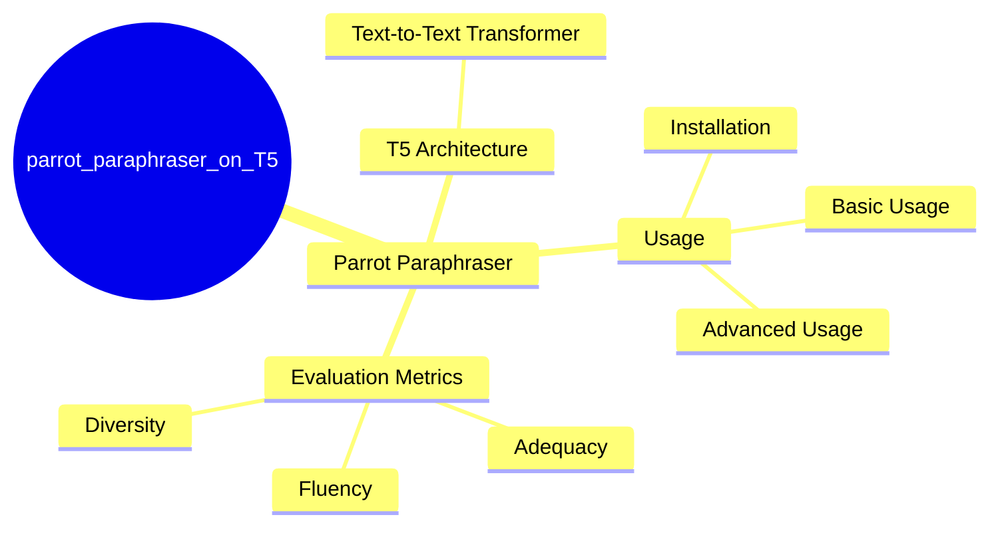
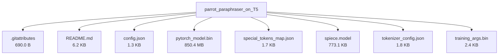

# prithivida/parrot_paraphraser_on_T5 - Technical Documentation

**Author:** prithivida  
**License:**   
**Last Modified:** 2021-05-18  
**HuggingFace URL:** [prithivida/parrot_paraphraser_on_T5](https://huggingface.co/prithivida/parrot_paraphraser_on_T5)


**Tags:** transformers, pytorch, t5, text2text-generation, autotrain_compatible, text-generation-inference, endpoints_compatible

---

[Architecture](#architecture) • [Usage Guides](#usage-guides) • [Benchmarks](#performance--benchmarks) • [Variants](#model-variants) • [Limitations](#model-limitations--ethical-considerations) • [Conceptual Summary](#conceptual-summary) • [File Tree](#file-tree) • [Use Cases](#use-cases) • [Research Papers](#research-papers) • [Hyperparameters](#key-hyperparameters) • [GitHub](#github-repository) • [Training Info](#training-data--derivatives) • [Future Work](#future-work--roadmap) • [External Resources](#external-resources)

---

## Architecture

The model is based on the T5 architecture, which is a text-to-text transformer model. The choice of T5 is driven by its ability to handle a wide range of NLP tasks, including text generation. The model is fine-tuned on paraphrasing tasks to generate diverse and fluent paraphrases while preserving the original meaning.

---

## Usage Guides

### Installation
<p>To use the Parrot paraphraser, you need to install the Parrot library from the GitHub repository.</p>
```python
pip install git+https://github.com/PrithivirajDamodaran/Parrot_Paraphraser.git
```
### Basic Usage
<p>Initialize the Parrot model and use it to generate paraphrases for given input phrases.</p>
```python
from parrot import Parrot
import torch
import warnings
warnings.filterwarnings("ignore")
parrot = Parrot(model_tag="prithivida/parrot_paraphraser_on_T5", use_gpu=False)
phrases = ["Can you recommend some upscale restaurants in Newyork?", "What are the famous places we should not miss in Russia?"]
for phrase in phrases:
    para_phrases = parrot.augment(input_phrase=phrase)
    for para_phrase in para_phrases:
        print(para_phrase)
```
### Advanced Usage
<p>You can control the diversity, adequacy, and fluency of the generated paraphrases using various knobs provided by the Parrot library.</p>
```python
para_phrases = parrot.augment(input_phrase=phrase, diversity_ranker="levenshtein", do_diverse=False, max_return_phrases=10, max_length=32, adequacy_threshold=0.99, fluency_threshold=0.90)
```
<p style="font-style: italic; font-size: 0.9em; margin-top: 1em;">
Note: This wiki uses static Markdown. For interactive examples, please refer to the original
<a href="https://huggingface.co/prithivida/parrot_paraphraser_on_T5" target="_blank">Hugging Face model page</a> or the
<a href="https://github.com/PrithivirajDamodaran/Parrot" target="_blank">GitHub repository</a>.
</p>

---

## Performance & Benchmarks

| Dataset | Metric | Value | Notes |
|---------|--------|-------|-------|
| No benchmark data yet | - | - | - |

---

## Model Variants

| Model | Parameters | Base Architecture |
|-------|------------|-------------------|
| Base Model | N/A | N/A |

---

## Model Limitations & Ethical Considerations

### Limitations
<p>The pre-trained model is trained on text samples of maximum length 32, making it suitable for short-text conversational interfaces.</p>

*No specific ethical considerations documented.*

---

## Conceptual Summary

Parrot is a paraphrase-based utterance augmentation framework designed to accelerate training NLU models. It utilizes a T5 model fine-tuned for paraphrasing, offering control over adequacy, fluency, and diversity of generated paraphrases.

### Model Design Flow (Mind Map)



---

## File Tree



### Files

| File | Size | Download |
|------|------|----------|
| `.gitattributes` | 690.0 B | [Download](https://huggingface.co/prithivida/parrot_paraphraser_on_T5/resolve/main/.gitattributes) |
| `README.md` | 6.2 KB | [Download](https://huggingface.co/prithivida/parrot_paraphraser_on_T5/resolve/main/README.md) |
| `config.json` | 1.3 KB | [Download](https://huggingface.co/prithivida/parrot_paraphraser_on_T5/resolve/main/config.json) |
| `pytorch_model.bin` | 850.4 MB | [Download](https://huggingface.co/prithivida/parrot_paraphraser_on_T5/resolve/main/pytorch_model.bin) |
| `special_tokens_map.json` | 1.7 KB | [Download](https://huggingface.co/prithivida/parrot_paraphraser_on_T5/resolve/main/special_tokens_map.json) |
| `spiece.model` | 773.1 KB | [Download](https://huggingface.co/prithivida/parrot_paraphraser_on_T5/resolve/main/spiece.model) |
| `tokenizer_config.json` | 1.8 KB | [Download](https://huggingface.co/prithivida/parrot_paraphraser_on_T5/resolve/main/tokenizer_config.json) |
| `training_args.bin` | 2.4 KB | [Download](https://huggingface.co/prithivida/parrot_paraphraser_on_T5/resolve/main/training_args.bin) |

---

## Use Cases

- Text augmentation for NLU models
- Paraphrasing for conversational interfaces

---

## Research Papers

### A good paraphrase should be adequate and fluent while being as different as possible on the surface lexical form

**URL:** [A good paraphrase should be adequate and fluent while being as different as possible on the surface lexical form](https://www.aclweb.org/anthology/D10-1090.pdf)

This paper discusses the key metrics for evaluating paraphrases, including adequacy, fluency, and diversity.

**Citation:**
```bibtex
@inproceedings{metropolis2010acl,D10-1090,
author = {Metropolis, N. and Rosenbluth, A. W. and Rosenbluth, M. N. and Teller, A. H. and Teller, E.},
title = {A good paraphrase should be adequate and fluent while being as different as possible on the surface lexical form},
booktitle = {Proceedings of the 48th Annual Meeting of the Association for Computational Linguistics},
year = {2010},
publisher = {Association for Computational Linguistics},
pages = {1036--1045},
location = {Uppsala, Sweden},
url = {https://www.aclweb.org/anthology/D10-1090}
}
```

---

---

## Key Hyperparameters

*No detailed hyperparameters documented.*

---

## GitHub Repository

**Repository:** [PrithivirajDamodaran/Parrot](https://github.com/PrithivirajDamodaran/Parrot)  
**Stars:** 0 | **Forks:** 0 | **Issues:** 0  
**Created:**  | **Last Updated:** 

Parrot is a paraphrase based utterance augmentation framework purpose built to accelerate training NLU models.

**Key Contributors:** PrithivirajDamodaran


---

## Training Data & Derivatives


---

## Future Work & Roadmap

*No future work or roadmap details provided.*

---

## External Resources

* **Additional Resources & Blog Posts:**
- [Parrot GitHub Repository](https://github.com/PrithivirajDamodaran/Parrot)
- [Hugging Face Paraphrase Models](https://huggingface.co/models?pipeline_tag=text2text-generation&search=paraphrase)
- [Rasa Forum Discussion on Paraphrasing](https://forum.rasa.com/t/paraphrasing-for-nlu-data-augmentation-experimental/27744)
- [NLPAug Library](https://github.com/makcedward/nlpaug)
- [PPDB Paraphrase Database](http://paraphrase.org/#/download)
- [Sentence Transformers Paraphrase Mining](https://www.sbert.net/examples/applications/paraphrase-mining/README.html)

---

*This page was automatically generated using LLaMA 4.* 