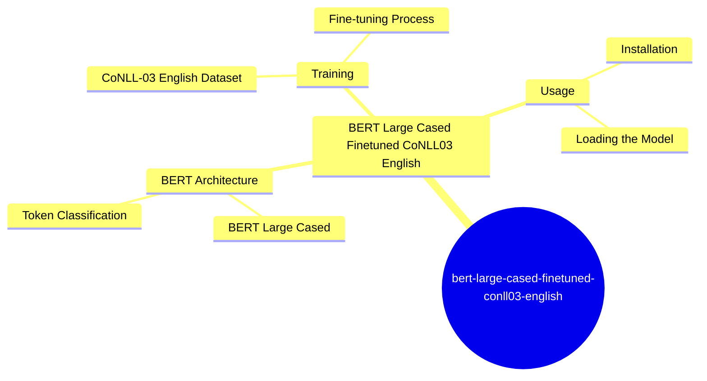
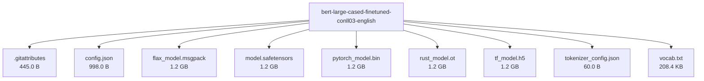

# dbmdz/bert-large-cased-finetuned-conll03-english - Technical Documentation

**Author:** dbmdz  
**License:**   
**Last Modified:** 2023-09-06  
**HuggingFace URL:** [dbmdz/bert-large-cased-finetuned-conll03-english](https://huggingface.co/dbmdz/bert-large-cased-finetuned-conll03-english)


**Tags:** transformers, pytorch, tf, jax, rust, safetensors, bert, token-classification, autotrain_compatible, endpoints_compatible

---

[Architecture](#architecture) • [Usage Guides](#usage-guides) • [Benchmarks](#performance--benchmarks) • [Variants](#model-variants) • [Limitations](#model-limitations--ethical-considerations) • [Conceptual Summary](#conceptual-summary) • [File Tree](#file-tree) • [Use Cases](#use-cases) • [Research Papers](#research-papers) • [Hyperparameters](#key-hyperparameters) • [GitHub](#github-repository) • [Training Info](#training-data--derivatives) • [Future Work](#future-work--roadmap) • [External Resources](#external-resources)

---

## Architecture

The model utilizes the BERT architecture, which is a transformer-based language model. The choice of BERT-large-cased is due to its ability to handle nuanced language understanding tasks. The fine-tuning on CoNLL-03 English dataset allows it to specialize in token classification, particularly in identifying named entities.

---

## Usage Guides

### Installation
<p>To use this model, you need to install the Hugging Face Transformers library. This can be done via pip.</p>
```python
pip install transformers
```
### Loading the Model
<p>You can load the model using the Hugging Face Transformers library. This involves importing the necessary classes and loading the model and tokenizer.</p>
```python
from transformers import BertTokenizer, BertForTokenClassification
tokenizer = BertTokenizer.from_pretrained('dbmdz/bert-large-cased-finetuned-conll03-english')
model = BertForTokenClassification.from_pretrained('dbmdz/bert-large-cased-finetuned-conll03-english')
```
<p style="font-style: italic; font-size: 0.9em; margin-top: 1em;">
Note: This wiki uses static Markdown. For interactive examples, please refer to the original
<a href="https://huggingface.co/dbmdz/bert-large-cased-finetuned-conll03-english" target="_blank">Hugging Face model page</a> or the
<a href="" target="_blank">GitHub repository</a>.
</p>

---

## Performance & Benchmarks

| Dataset | Metric | Value | Notes |
|---------|--------|-------|-------|
| No benchmark data yet | - | - | - |

---

## Model Variants

| Model | Parameters | Base Architecture |
|-------|------------|-------------------|
| Base Model | N/A | N/A |

---

## Model Limitations & Ethical Considerations

### Limitations
<p>The model is fine-tuned for token classification tasks and may not perform well on other tasks without further fine-tuning. It is also limited by the quality and diversity of the training data.</p>

*No specific ethical considerations documented.*

---

## Conceptual Summary

This model is a fine-tuned version of BERT-large-cased for token classification tasks, specifically trained on the CoNLL-03 English dataset. It is designed to identify and classify named entities in text.

### Model Design Flow (Mind Map)



---

## File Tree



### Files

| File | Size | Download |
|------|------|----------|
| `.gitattributes` | 445.0 B | [Download](https://huggingface.co/dbmdz/bert-large-cased-finetuned-conll03-english/resolve/main/.gitattributes) |
| `config.json` | 998.0 B | [Download](https://huggingface.co/dbmdz/bert-large-cased-finetuned-conll03-english/resolve/main/config.json) |
| `flax_model.msgpack` | 1.2 GB | [Download](https://huggingface.co/dbmdz/bert-large-cased-finetuned-conll03-english/resolve/main/flax_model.msgpack) |
| `model.safetensors` | 1.2 GB | [Download](https://huggingface.co/dbmdz/bert-large-cased-finetuned-conll03-english/resolve/main/model.safetensors) |
| `pytorch_model.bin` | 1.2 GB | [Download](https://huggingface.co/dbmdz/bert-large-cased-finetuned-conll03-english/resolve/main/pytorch_model.bin) |
| `rust_model.ot` | 1.2 GB | [Download](https://huggingface.co/dbmdz/bert-large-cased-finetuned-conll03-english/resolve/main/rust_model.ot) |
| `tf_model.h5` | 1.2 GB | [Download](https://huggingface.co/dbmdz/bert-large-cased-finetuned-conll03-english/resolve/main/tf_model.h5) |
| `tokenizer_config.json` | 60.0 B | [Download](https://huggingface.co/dbmdz/bert-large-cased-finetuned-conll03-english/resolve/main/tokenizer_config.json) |
| `vocab.txt` | 208.4 KB | [Download](https://huggingface.co/dbmdz/bert-large-cased-finetuned-conll03-english/resolve/main/vocab.txt) |

---

## Use Cases

- Named Entity Recognition (NER) tasks, where the model can be used to identify and classify entities in unstructured text.
- Information extraction tasks, where the model can help in extracting relevant information from text by identifying key entities.

---

## Research Papers

*No research papers available.*

---

## Key Hyperparameters

*No detailed hyperparameters documented.*

---

## GitHub Repository

**Repository:** []()  
**Stars:** 0 | **Forks:** 0 | **Issues:** 0  
**Created:**  | **Last Updated:** 


---

## Training Data & Derivatives

**Training Datasets:**
- `CoNLL-03 English`


---

## Future Work & Roadmap

<p>Further fine-tuning on specific datasets or tasks could improve performance. Exploring techniques like quantization or distillation could make the model more efficient.</p>

---

## External Resources

*No additional external resources.*

---

*This page was automatically generated using LLaMA 4.* 