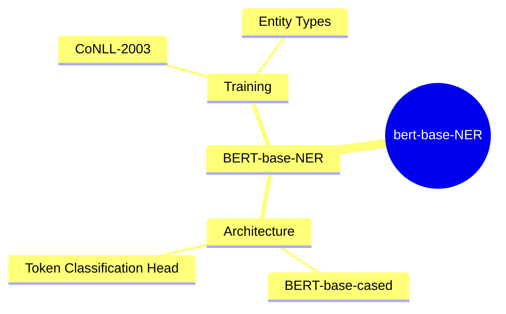
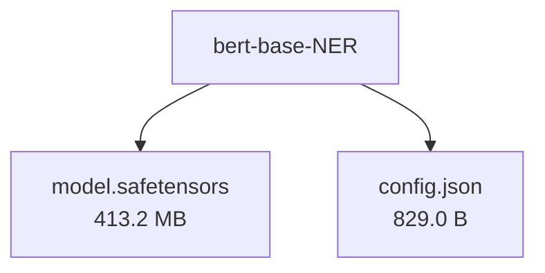

# dslim/bert-base-NER - Technical Documentation

**Author:** dslim  
**License:** mit  
**Last Modified:** 2024-10-08  
**HuggingFace URL:** [dslim/bert-base-NER](https://huggingface.co/dslim/bert-base-NER)


**Tags:** transformers, pytorch, tf, jax, onnx, safetensors, bert, token-classification, en, dataset:conll2003, license:mit

---

[Architecture](#architecture) • [Usage Guides](#usage-guides) • [Benchmarks](#performance--benchmarks) • [Variants](#model-variants) • [Limitations](#model-limitations--ethical-considerations) • [Conceptual Summary](#conceptual-summary) • [File Tree](#file-tree) • [Use Cases](#use-cases) • [Research Papers](#research-papers) • [Hyperparameters](#key-hyperparameters) • [GitHub](#github-repository) • [Training Info](#training-data--derivatives) • [Future Work](#future-work--roadmap) • [External Resources](#external-resources)

---

## Architecture

Based on BERT's bidirectional transformer architecture, this model fine-tunes the bert-base-cased model (110M parameters) specifically for token classification. It uses deep bidirectional representations and maintains the original BERT architecture with an additional classification layer for NER tagging.

---

## Usage Guides

### Basic NER Inference
<p>How to perform basic named entity recognition using the Transformers pipeline</p>
```python
from transformers import AutoTokenizer, AutoModelForTokenClassification
from transformers import pipeline

tokenizer = AutoTokenizer.from_pretrained("dslim/bert-base-NER")
model = AutoModelForTokenClassification.from_pretrained("dslim/bert-base-NER")

nlp = pipeline("ner", model=model, tokenizer=tokenizer)
example = "My name is Wolfgang and I live in Berlin"

ner_results = nlp(example)
```
<p style="font-style: italic; font-size: 0.9em; margin-top: 1em;">
Note: This wiki uses static Markdown. For interactive examples, please refer to the original
<a href="https://huggingface.co/dslim/bert-base-NER" target="_blank">Hugging Face model page</a> or the
<a href="" target="_blank">GitHub repository</a>.
</p>

---

## Performance & Benchmarks

### Performance on CoNLL-2003 Test Set
<p>Model evaluation results on the CoNLL-2003 NER test dataset</p>
| Metric | Score |
|---------|--------|
| F1 | 91.3 |
| Precision | 90.7 |
| Recall | 91.9 |

---

## Model Variants

| Model | Parameters | Base Architecture |
|-------|------------|-------------------|
| Base Model | N/A | N/A |

---

## Model Limitations & Ethical Considerations

### Limitations
<p>The model is limited by its training dataset of entity-annotated news articles from a specific time period, which may not generalize well to all domains. It can occasionally tag subword tokens as entities, requiring post-processing for optimal results.</p>

### Ethical Considerations
<p>The model may reflect biases present in its training data, which consists primarily of news articles. Users should be aware of potential demographic and geographic biases in entity recognition.</p>

---

## Conceptual Summary

A fine-tuned BERT model for Named Entity Recognition (NER) that achieves state-of-the-art performance. Built on bert-base-cased and trained on the CoNLL-2003 NER dataset, it recognizes four entity types: Location (LOC), Organizations (ORG), Person (PER), and Miscellaneous (MISC).

### Model Design Flow (Mind Map)



---

## File Tree



### Files

| File | Size | Download |
|------|------|----------|
| `model.safetensors` | 413.2 MB | [Download](https://huggingface.co/dslim/bert-base-NER/resolve/main/model.safetensors) |
| `config.json` | 829.0 B | [Download](https://huggingface.co/dslim/bert-base-NER/resolve/main/config.json) |

---

## Use Cases

- Named Entity Recognition in text to identify and classify entities like people, organizations, locations, and miscellaneous entities
- Information Extraction from news articles and similar content
- Document processing where entity identification is required

---

## Research Papers

### BERT: Pre-training of Deep Bidirectional Transformers for Language Understanding

**URL:** [BERT: Pre-training of Deep Bidirectional Transformers for Language Understanding](https://arxiv.org/pdf/1810.04805)

Introduces BERT, a bidirectional transformer model that achieves state-of-the-art results on various NLP tasks through pre-training and fine-tuning

**Citation:**
```bibtex
@article{devlin2018bert, title={BERT: Pre-training of Deep Bidirectional Transformers for Language Understanding}, author={Devlin, Jacob and Chang, Ming-Wei and Lee, Kenton and Toutanova, Kristina}, journal={arXiv preprint arXiv:1810.04805}, year={2018}}
```

---

---

## Key Hyperparameters

| Parameter | Value |
| :-------- | :---- |
| Model Type | bert-base-cased |
| Number of Parameters | 110M |

---

## GitHub Repository

*GitHub repository information not available.*

---

## Training Data & Derivatives


---

## Future Work & Roadmap

<p>Potential improvements include incorporating document context, experimenting with CRF layers, and expanding the range of recognized entity types.</p>

---

## External Resources

* **Additional Resources & Blog Posts:**
- [CoNLL-2003 Dataset Paper](https://www.aclweb.org/anthology/W03-0419.pdf)
- [BERT Implementation Discussion](https://github.com/google-research/bert/issues/223)

---

*This page was automatically generated using LLaMA 4.* 