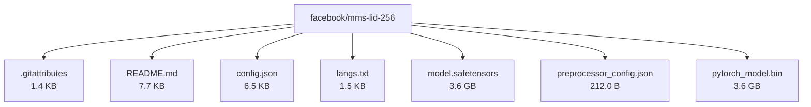

# facebook/mms-lid-256

**Author:** facebook  
**Last Updated:** 2023-06-13  
**License:** cc-by-nc-4.0  
**Repository:** [facebook/mms-lid-256](https://huggingface.co/facebook/mms-lid-256)

---

[Overview](#overview) • [Architecture](#architecture) • [File Tree](#file-tree) • [Use Cases](#use-cases) • [Benchmarks](#benchmarks) • [Variants](#model-variants) • [References](#references)

---

## Overview

The facebook/mms-lid-256 model is a massively multilingual speech language identification model, part of Facebook's Massively Multilingual Speech project. It is based on the Wav2Vec2 architecture and classifies raw audio input into a probability distribution over 256 output classes, each representing a language.

---

## Architecture

The model uses the Wav2Vec2 architecture, which is a type of automatic speech recognition (ASR) model. It consists of 1 billion parameters and has been fine-tuned from facebook/mms-1b on 256 languages. The model takes raw audio input sampled at 16,000 kHz and outputs a probability distribution over 256 languages.

---

## File Tree

### Files

| File | Size | Download |
|------|------|----------|
| .gitattributes | 1.4 KB | [Download](https://huggingface.co/facebook/mms-lid-256/resolve/main/.gitattributes) |
| README.md | 7.7 KB | [Download](https://huggingface.co/facebook/mms-lid-256/resolve/main/README.md) |
| config.json | 6.5 KB | [Download](https://huggingface.co/facebook/mms-lid-256/resolve/main/config.json) |
| langs.txt | 1.5 KB | [Download](https://huggingface.co/facebook/mms-lid-256/resolve/main/langs.txt) |
| model.safetensors | 3.6 GB | [Download](https://huggingface.co/facebook/mms-lid-256/resolve/main/model.safetensors) |
| preprocessor_config.json | 212.0 B | [Download](https://huggingface.co/facebook/mms-lid-256/resolve/main/preprocessor_config.json) |
| pytorch_model.bin | 3.6 GB | [Download](https://huggingface.co/facebook/mms-lid-256/resolve/main/pytorch_model.bin) |

---

## Use Cases

- Speech language identification: The model can be used to identify the spoken language of an audio sample.
- Multilingual speech processing: The model can be used as a component in multilingual speech processing pipelines.

---

## Benchmarks

The MMS multilingual speech recognition model more than halves the word error rate of Whisper on 54 languages of the FLEURS benchmark while being trained on a small fraction of the labeled data.

---

## Model Variants

| Model | Parameters | Base Architecture |
|-------|------------|-------------------|
| BERT-Base | 110M | Transformer Encoder |
| BERT-Large | 340M | Transformer Encoder |
| DistilBERT | 66M | Distilled BERT |
| RoBERTa | 125M | Optimized BERT |
| ALBERT | 12M-235M | Parameter-shared BERT |

---

## References

- https://ai.facebook.com/blog/multilingual-model-speech-recognition/
- https://arxiv.org/abs/2305.13516
- https://dl.fbaipublicfiles.com/mms/misc/language_coverage_mms.html
- https://en.wikipedia.org/wiki/ISO_639-3
- https://github.com/facebookresearch/fairseq/tree/main/examples/mms#asr
- https://huggingface.co/docs/transformers/main/en/model_doc/mms
- https://huggingface.co/docs/transformers/model_doc/wav2vec2
- https://huggingface.co/facebook/mms-1b
- https://huggingface.co/facebook/mms-300m
- https://huggingface.co/harshit345/xlsr-wav2vec-speech-emotion-recognition
- https://huggingface.co/models?other=mms
- https://huggingface.co/spaces/facebook/MMS
- https://pypi.org/project/transformers/
- https://research.facebook.com/publications/scaling-speech-technology-to-1000-languages/

---

*This page was automatically generated using LLaMA 4 and validated using Pydantic.* 